# I. Before joining IDOs

---
## Test

## 1.1. Register Account

### 1.1.1. Step 1. Go to Red Kite Website

* Go to [**https://redkite.polkafoundry.com**](https://redkite.polkafoundry.com).
* Click Pools or View All Projects to view the Pools Dashboard.

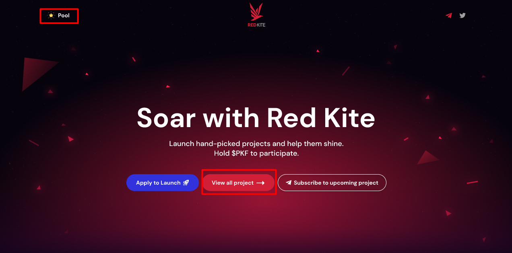

### 1.1.2. Step 2. Connect your Wallet

* You must connect your wallet first to register new account.
* Click the “Connect Wallet” button in the header to connect your Wallet.

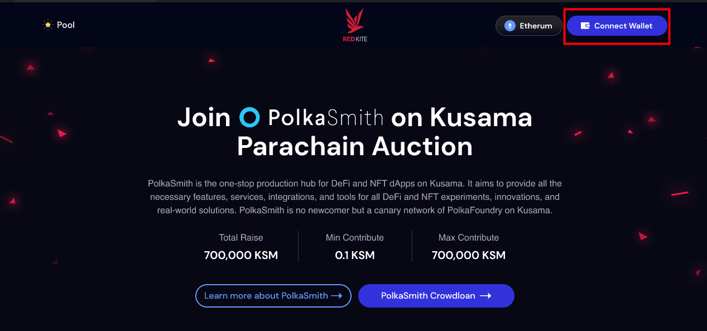

### 1.1.3. Step 3. Choose Network and Wallet

* On the Connect Wallet popup, choose the Network and the Wallet you use.

   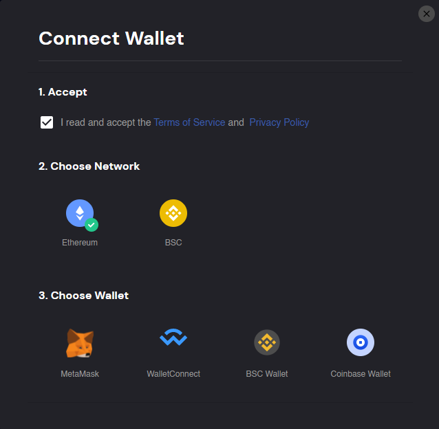

   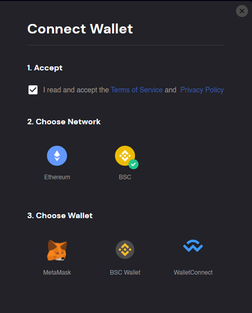

### 1.1.4. Step 4. KYC

* “My Account” menu will appear once you successfully connect to your wallet address.

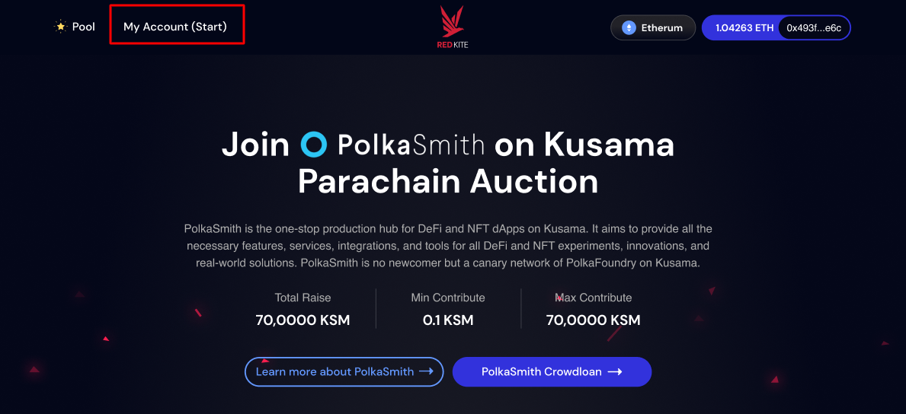

* Go to **My Account > Profile menu**, you will see your KYC’s status as “Unverified”.

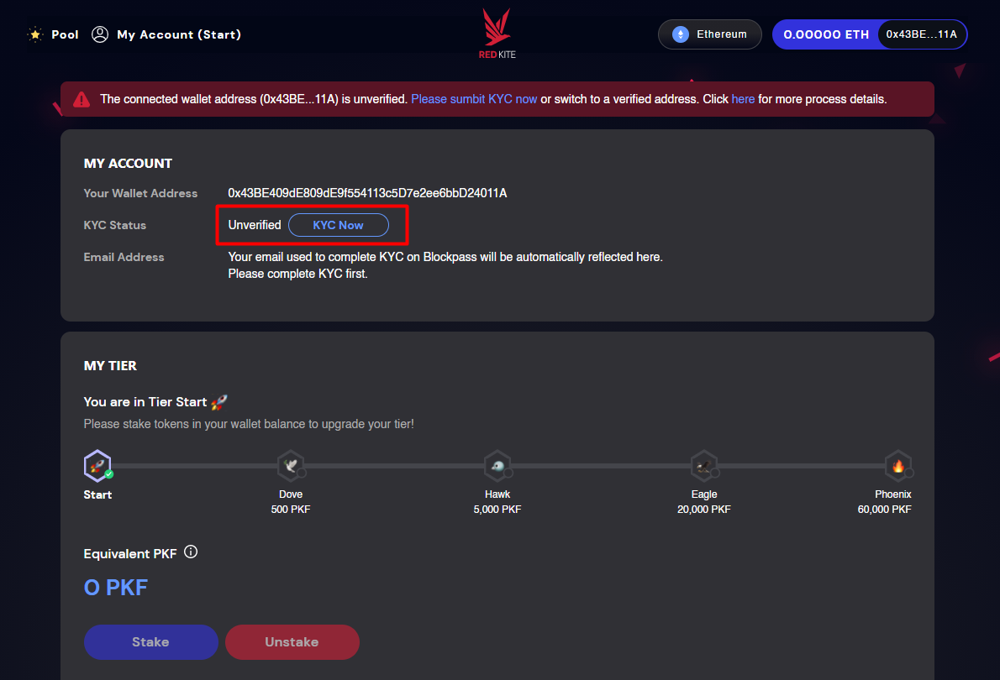

* Click “KYC Now” button. It will navigate you to Red Kite KYC on Blockpass. 

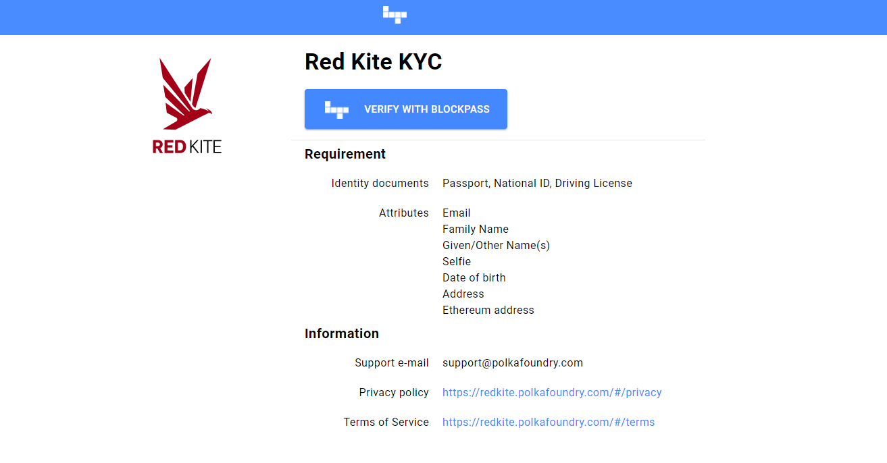

* Fill in all the necessary information to complete the KYC process.

  * Your KYC’s status on Red Kite will be changed to "Verified” once you pass the KYC process successfully.
  * The email you use on Blockpass for KYC will be automatically reflected on Red Kite.

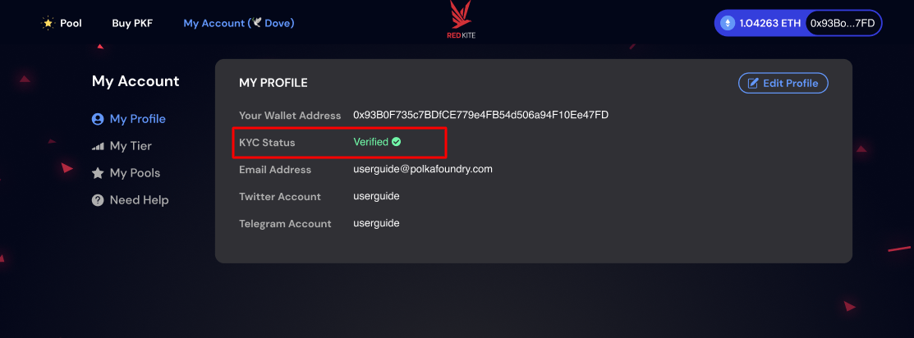

## 1.2. Sign in

* Click the “Connect Wallet” button in the header. Be sure to select the wallet address you have already registered to sign in.

  * If you want to use a different wallet address, you will need to register as a new account. Refer [**1.1. Register Account**](/guides/before-joining-idos.html#_1-1-register-account) for more details.

## 1.3. Stake / Unstake

### 1.3.1. Applicable networks

* Stake / Unstake tokens on Red Kite are currently only supported by Ethereum Network.  
* To switch from BSC Network to Ethereum Network: Change the network on your wallet, the network on Red Kite will be updated accordingly. 
* If you are using BSC Wallet, you can refer to the steps below to add your account to Ethereum Wallet.

  * Step 1: Export Private Key of BSC Wallet
    * Open your BSC Wallet
    * Click dot icon and select Export Private Key 

  * Step 2: Import Private Key to Ethereum Wallet
    * Add a new account to your Ethereum Wallet using your exported Private Key
    * After you have successfully added, please use your Ethereum network and wallet to stake/ unstake on Red Kite

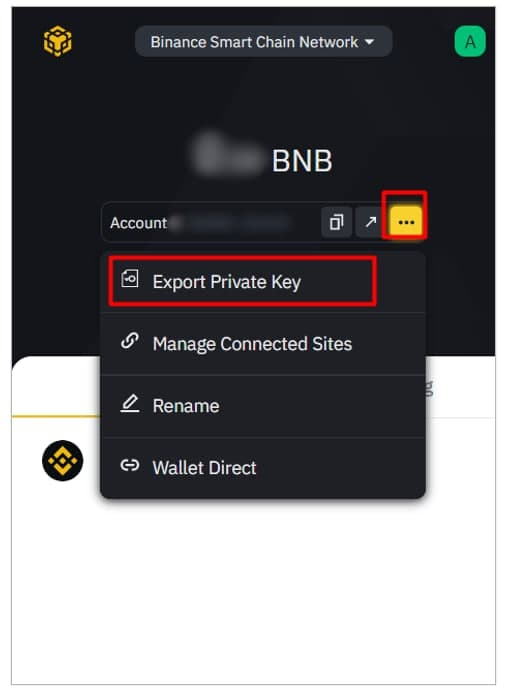

### 1.3.2. Stake

Go to **My Account > My Tier** to stake / unstake tokens. Click [here](https://redkite-faq.polkafoundry.com/guides/myaccount.html#_5-1-how-to-access-network) to learn how to access this menu.

Your tier on Red Kite is determined by Total Red Kite points. Click [here](https://redkite-faq.polkafoundry.com/guides/myaccount.html#_5-2-my-profile) to learn more about My Tier menu.

**1.3.2.1 Step 1. Approve**

* You need to Approve Red Kite Smart Contract once (and only once) before staking. If you have already approved, you can skip this step.
* Go to My Account, click “Stake” button on “My Tier”. It will navigate you to Staking Screen.

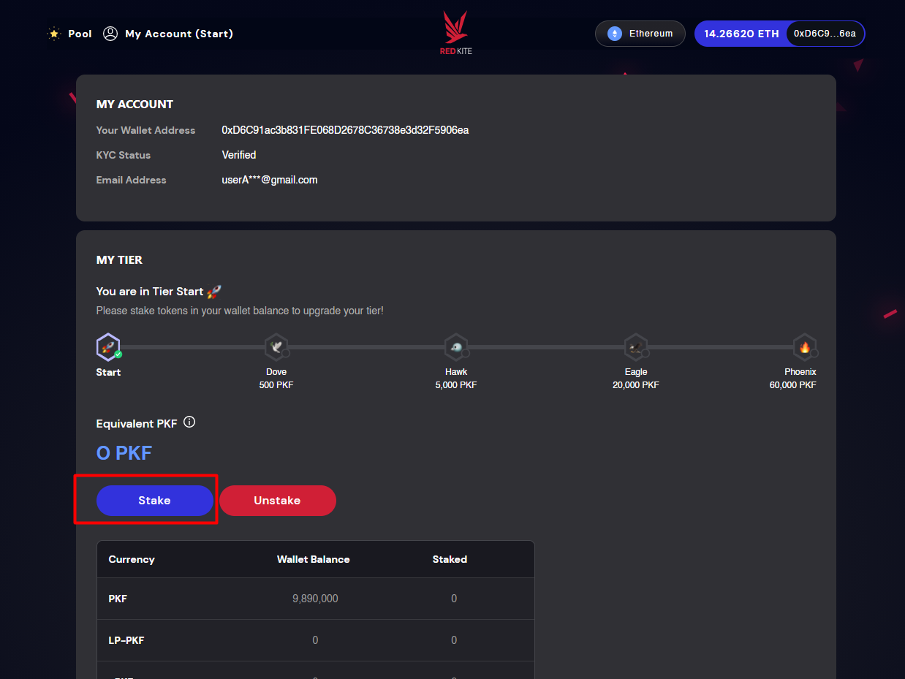

* On this screen:
  * Choose the token you want to approve (PKF or LP-PKF) from the drop-down list
  * Input the amount you want to approve or click Max to auto-fill with your maximum capability
  * Click the “Approve” button. It will connect you to your wallet address. Accept the transaction and you have approved successfully. 

* Conversation Rate: 1 Uniswap LP = 150 $PKF.

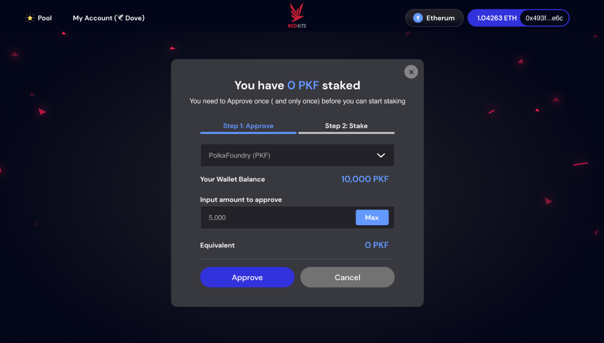

**1.3.3.2. Step 2. Stake**

* You can stake to Red Kite after approving successfully.

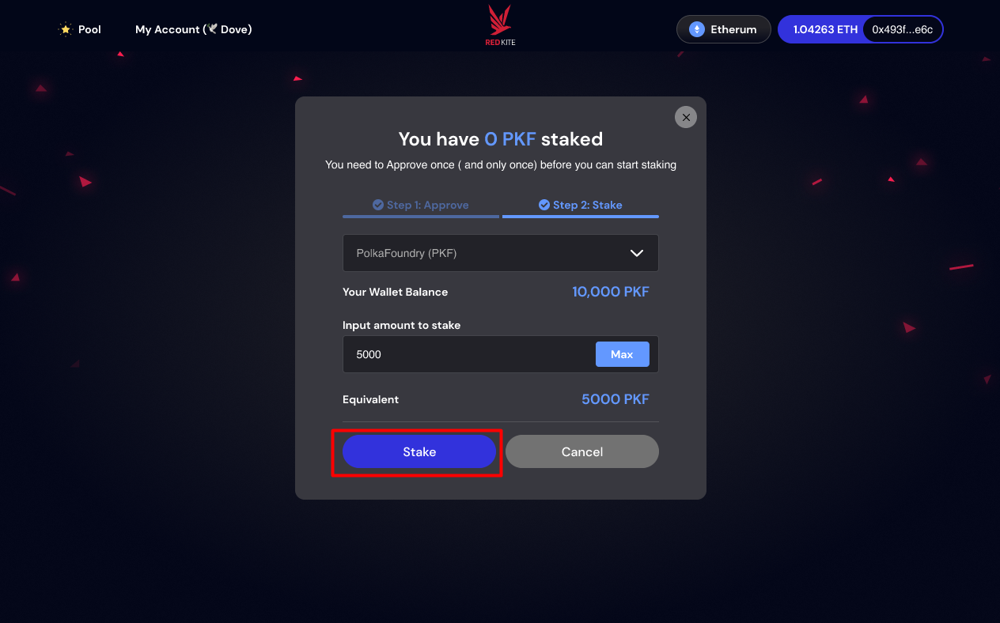

::: warning NOTE
If you have already approved, the Staking screen will appear as below when you click the "Staking" button on the "My Account" screen.
:::

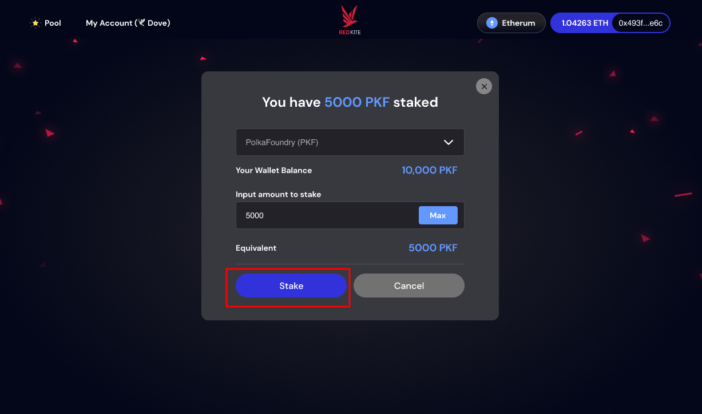

* On this screen:
  * Enter the token amount you want to stake or click Max to auto-fill with your maximum capability. 
  * Click “Stake” button, Metamask will prompt you to confirm the transaction.

* After confirming, you will see an option to view your transaction on Etherscan.

::: tip TIP
Due to network congestion, your transaction could take some time. You may need to wait or consider speeding up your transaction.
:::

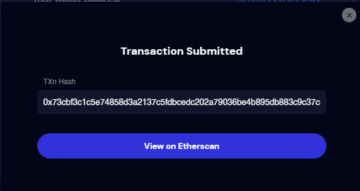

* Once the transaction is confirmed, you can verify your wallet balance, staked amount and the obtained tier on the "My Tier" menu of “My Account” screen.

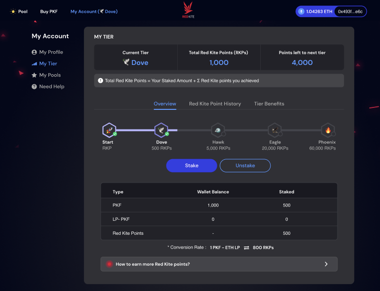

### 1.3.3. Unstake

* Click “Unstake” button on the ‘My Tier” screen.
* Follow the same procedure for staking tokens.

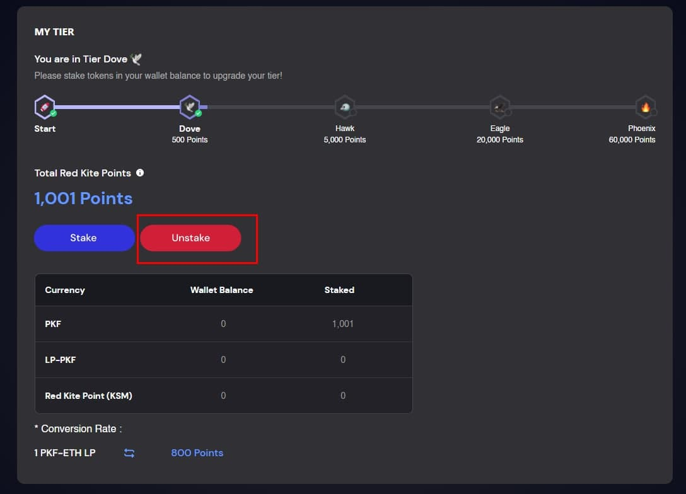

## 1.4. Join A Pool and Apply for Whitelist

::: tip UPDATE POINTS!
* We have integrated the whitelist application form to Red Kite.
* You can track and confirm your whitelist status as Success, Fail or Pending.
:::

### 1.4.1. Step 1. Choose a Pool

* Go to the “Upcoming” area in Pool Dashboard, select the pool you want to join whitelist and open its details.

**1.4.1.1. Before whitelist opens**

* You can see the countdown to when you can apply for the whitelist in the “Pool Timeline” section.

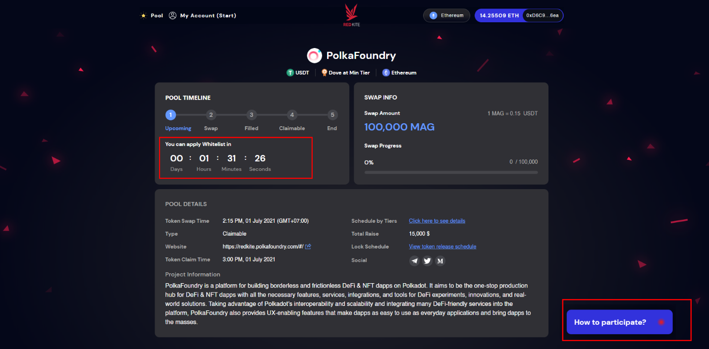

* To participate in the whitelist, you must:
  * Pass KYC
  * Achieve the minimum pool tier
  * Click the “Apply Whitelist” button
* You can click “How to participate” to check if you have met all the requirements to join the pool.

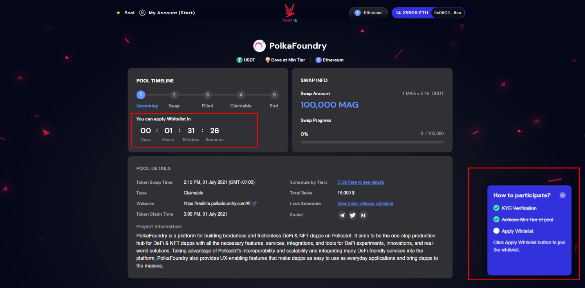

**1.4.2.1. Whitelist opening time**

* The “Apply Whitelist” button will appear when the whitelist is opened.

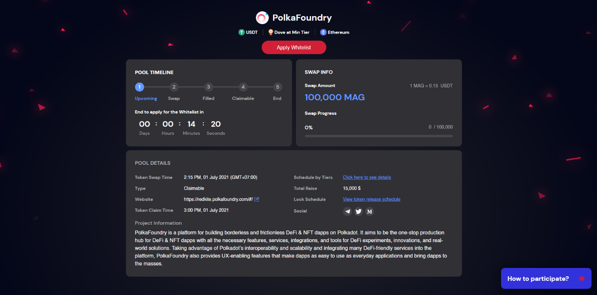

::: warning NOTE
“Apply Whitelist” Button is disabled if you do not meet the conditions to apply for whitelisting.  For example, if you have not achieved min tier of pool:
* An error message is displayed in the header as in the following screen.
* “Apply Whitelist” button is disabled
:::

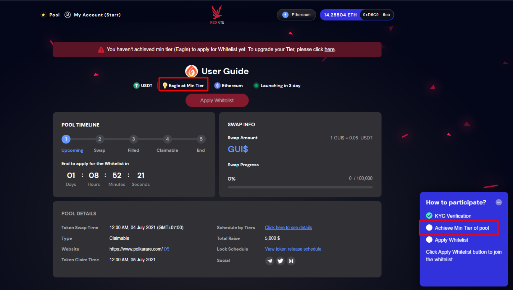

### 1.4.2. Step 2. Click “Apply Whitelist”

* The Whitelist popup is shown after clicking “Apply Whitelist” button in Pool Detail.
* The requirements to join the whitelist are different for each pool and are decided by the project team. 
* Before clicking “Apply Whitelist” button on the popup, make sure that:
  * You have completed all tasks required by the project’s team according to your tier.
  * You have entered your Twitter and Telegram’s username.

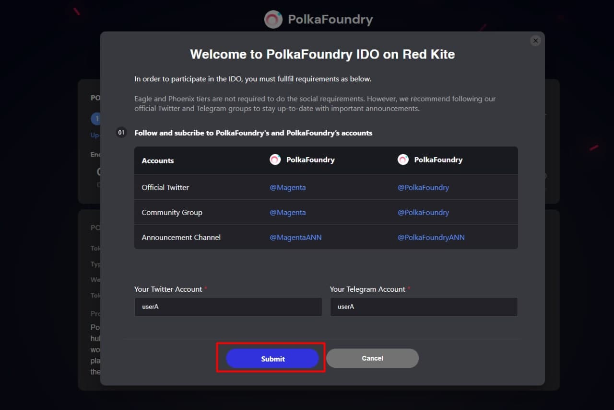

* The system will verify your information after you click “Apply Whitelist” button.

**1.4.2.1. Case 1: Success**

* Once you passed all the requirements for the whitelist, Red Kite will ask you to sign on your Wallet. 
* Click “Sign” on your wallet and you have successfully applied the whitelist. Please wait for the winner allocation to be announced.

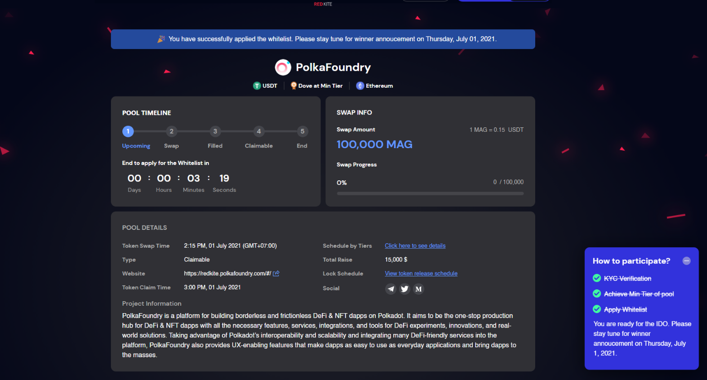

**1.4.2.2. Case 2: Fail**

* You cannot apply whitelist if:
  * You have not entered your Twitter and/or Telegram’s accounts
  * You have not followed or subscribed to the social accounts as required by the pool
* Please complete all requirements and click the “Apply Whitelist” button on the popup again.

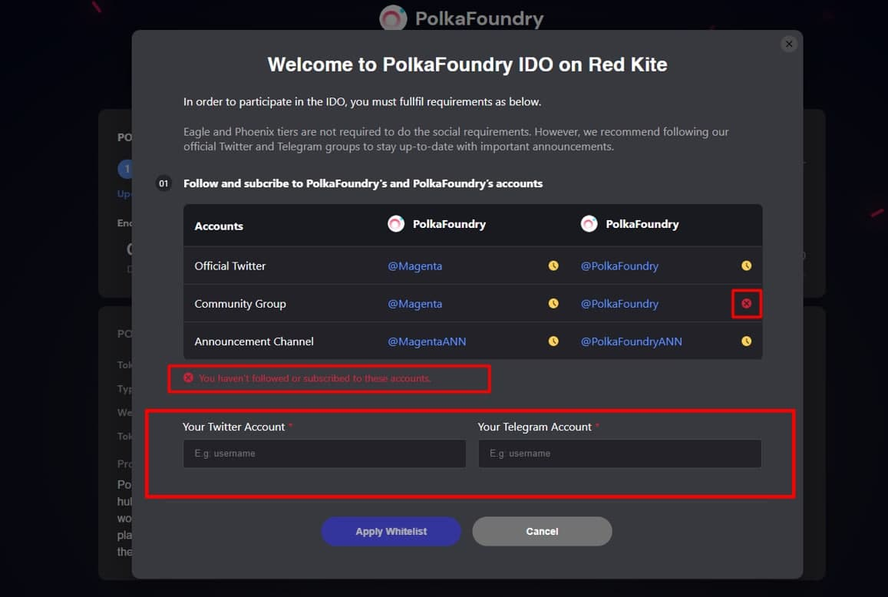

**1.4.2.3. Case 3: Pending (Dove & Hawk Tier)**

* Your whitelist application might be pending due to some unforeseen technical issues (Ex: overload check) that occurred during the verification of your social requirements. 
* We will check and verify your application later in a short time. You can click “Whitelist Status” button to check your social requirement’s status. 
* Once all the requirements are met, your whitelist application will be approved.

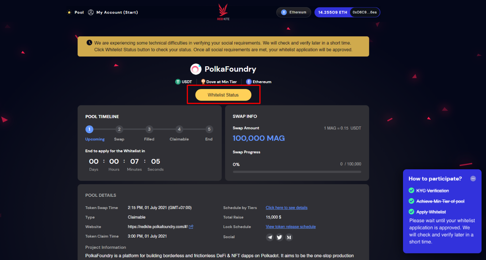
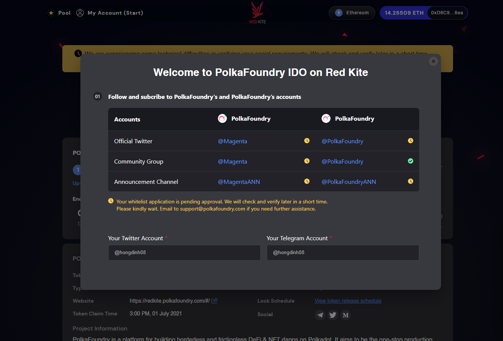

::: tip INFORMATION
Meaning of Social Requirement Verification’s Icons.
:::

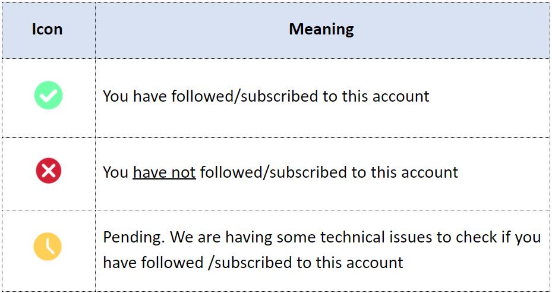
