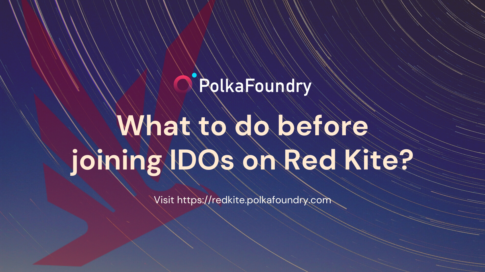

### Updates on May 24, 2021:

* Red Kite is now supporting Coinbase Wallet and BSC Wallet (BSC Network);
* Simplify email verification process: Users only need to click the Verify Email button and fill in their correct email. No more verification link;
* Integrate [**Blockpass**](https://verify-with.blockpass.org/?clientId=red_kite_kyc_7a0e6&serviceName=Red%20Kite%20KYC&env=prod) 
into Red Kite for faster and more secure KYC process. Users who passed the KYC process in the last IDO don’t need to do KYC again;
* Change CTA button: Click on the **Apply Whitelist** button, then fill a Whitelist form to join a pool.

---

### I. HOW TO REGISTER, CONNECT WALLET, AND KYC

<h3> 1.1. Step 1: Go to Red Kite Website </h3>

* Go to [**https://redkite.polkafoundry.com/**](https://redkite.polkafoundry.com/);
* Click **Pools** or **View All Projects** to view the Pool Dashboard.

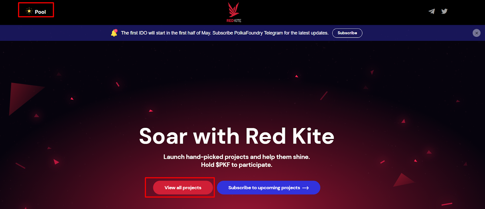

<h3> 1.2. Step 2: Connect your Wallet </h3>

* Click the **Connect Wallet** button on the header to connect your Wallet;

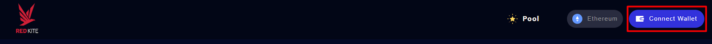

* We have integrated Coinbase Wallet and BSC Network into Red Kite. You can choose either Etherum Network or BSC Network to connect your wallet.

::: danger IMPORTANT NOTE
1. If you change the network (Ethereum <-> BSC) but still use the same wallet address that has been verified, you do not need to register again. All your information such as Email Address and Tier will remain the same.
2. On the other hand, if you want to use a new Wallet Address instead of your verified one, you need to use another email address, which is different from the one you used to verify, to register again (Verify Email > KYC > Stake).
:::

**1.2.1. Ethereum Network**

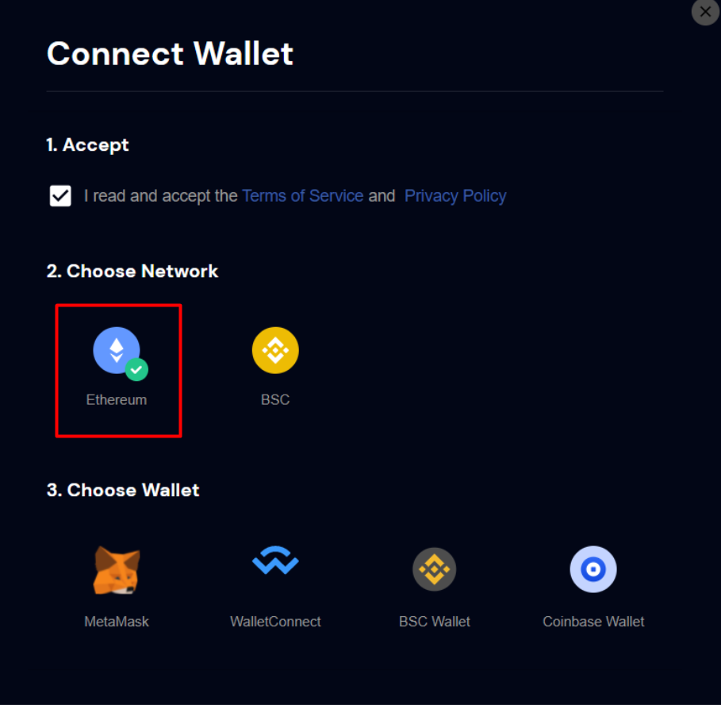

* In addition to MetaMask, WalletConnect, and BSC Wallet, we now support Coinbase Wallet.
* Install Coinbase Wallet extension or scan QR code on the mobile app to connect your wallet.

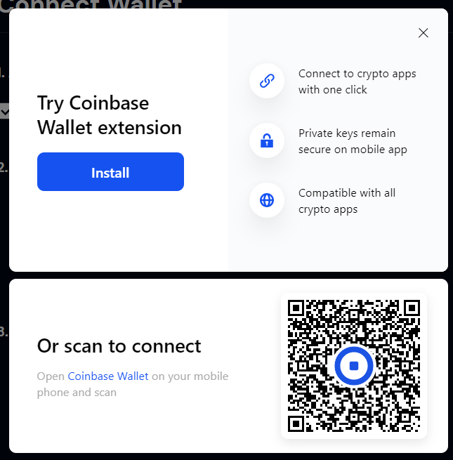

**1.2.2. BSC Network**

* Choose BSC Network and connect your Metamask or BSC Wallet.

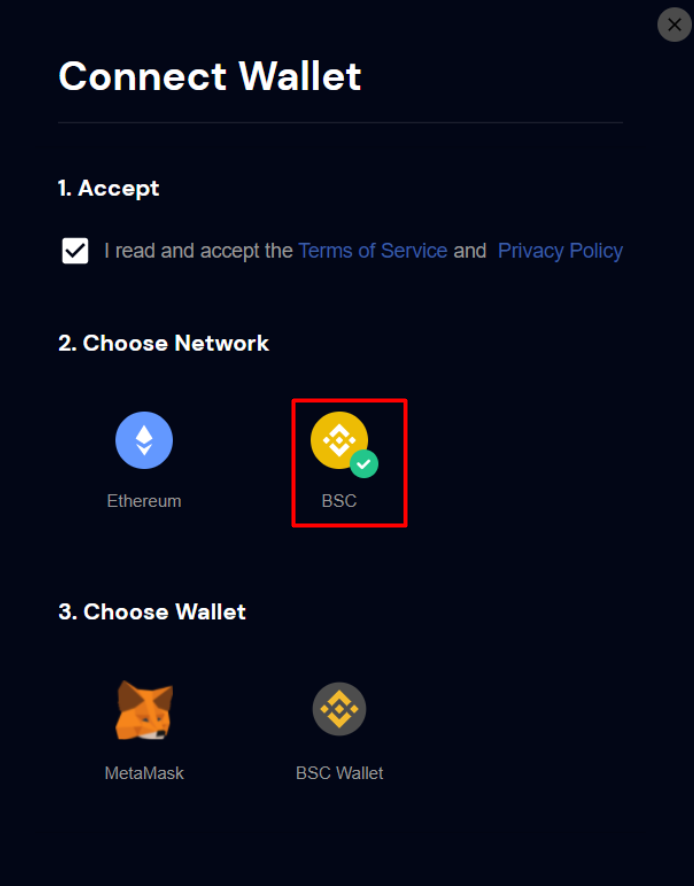

<h3> 1.3. Step 3: Verify your email </h3>

* The **My Account** menu will appear once you successfully connect to your address;
* Click the **Verify Email** button;
* Input your email address to verify your email. You cannot perform any action (KYC, joining a pool, staking, etc.) until your email address is verified.

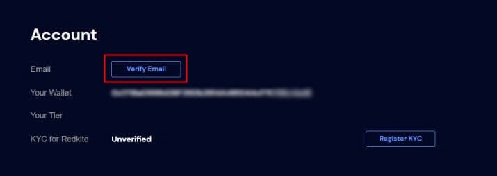

<h3> 1.4. Step 4: KYC </h3>

* We are pleased to announce that we have integrated Blockpass into the Red Kite launchpad for KYC verification.

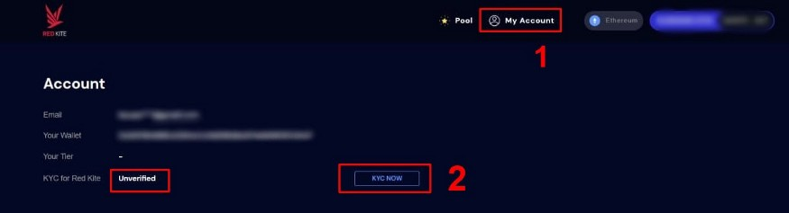

* In the **My Account** (1) menu, you will see your KYC’s status as “Unverified”;
* Click the **KYC NOW button** (2), and then it will navigate you to Red Kite KYC on [**Blockpass**](https://verify-with.blockpass.org/?clientId=red_kite_kyc_7a0e6&serviceName=Red%20Kite%20KYC&env=prod);
* Fill in all the necessary information to complete the KYC process.

::: danger NOTE
Make sure you **use the same email address as the one you used on Red Kite.**
:::

* Once you passed the KYC process successfully, your KYC’s status on Red Kite will be changed to “Verified.”

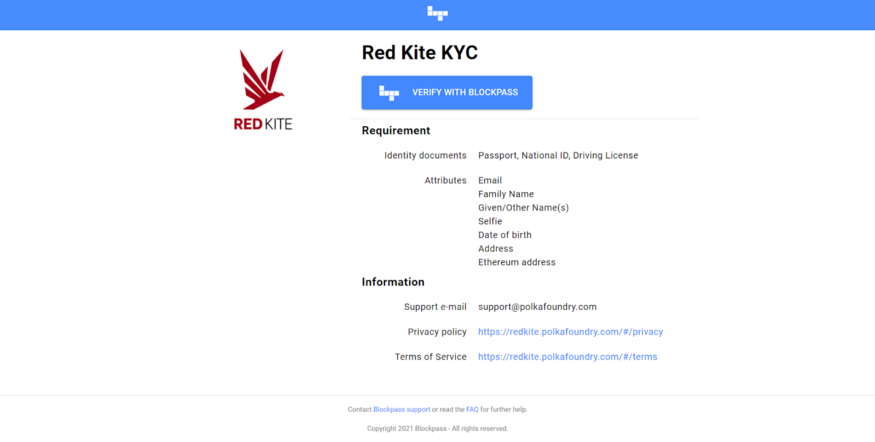

<h3> 1.5. Step 5: Ready to stake with Red Kite </h3>

Once your email address is verified, you can start staking into Red Kite to claim your tiers in the **My Account** menu.

* You can read more about Red Kite’s tiers and stake duration announced [HERE](https://medium.com/polkafoundry/red-kite-tier-announcement-adcba9ab47cd).
* You can only stake $PKF, Uniswap LP, and sPKF(*) in Red Kite.

::: danger NOTE
sPKF is the token resulting from staking $PKF on MANTRA DAO. We discontinued this staking pool. However, both sPKF bonding on MANTRA DAO or in your Red Kite account is still counted. We will guarantee the rights of MANTRA DAO stakers in any situation.
:::

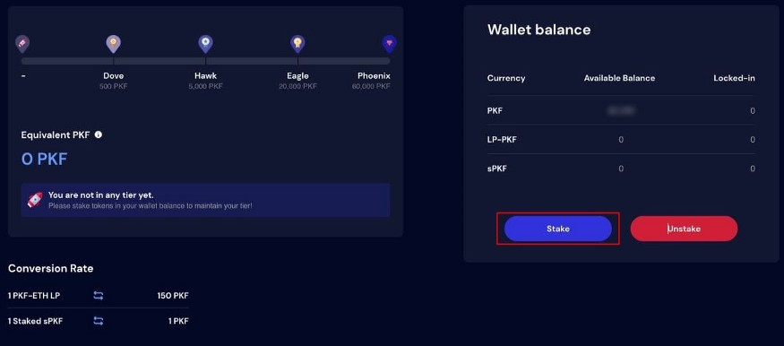

### II. HOW TO STAKE/UNSTAKE

<h3> 2.1. Applicable networks </h3>

Stake/Unstake tokens on Red Kite are currently only supported by Ethereum Network.

* If you are using BSC Network on your wallet, please switch to Ethereum Network.
* If you are using BSC Wallet, you can refer to the following steps to add your account to Ethereum Wallet.

***2.1.1. Step 1: Export private key***

* Open your BSC Wallet;
* Click the dot icon and select Export Private Key.

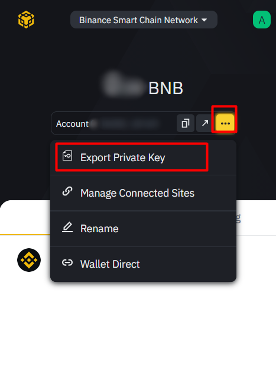

***2.1.2. Step 2: Import Private Key to Ethereum Wallet***

* Add a new account to your Ethereum Wallet using your exported Private Key;;
* After you have successfully added, please use your Ethereum network and wallet to stake/unstake on Red Kite.

<h3> 2. 2. Staking </h3>

***2.2.1. Step 1: Approve tokens***

* You need to **Approve** tokens once (and only once) before staking. If you have already approved, you can skip this step;
* Click on **Stake**, and then it would connect to your wallet;
* Accept the transaction which reflects;
* Choose the token you want to approve from the $PKF, Uniswap LP, and sPKF in the drop-down list;
* Add the token amount you want to approve or click **Max** to auto-fill with your maximum capability;
* Click the **Approve** button. It would again reconnect to your wallet;
* Accept the transaction.

::: danger CONVERSION RATE
1 Uniswap LP = 150 $PKF

1 sPKF = 1 $PKF
:::

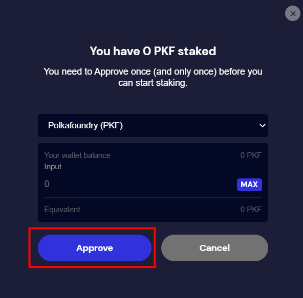

***2.2.2. Step 2: Stake tokens***

* Click the **Stake** button again in the **Wallet Balance** section after approving the token successfully. The Stake popup will appear.
* Enter the token amount you would like to stake or click **Max** to auto-fill with your maximum capability;
* Click the **Stake** button.

::: danger NOTE
Make sure you select the approved token ($PKF, Uniswap LP, or sPKF tokens)in the previous steps.
:::

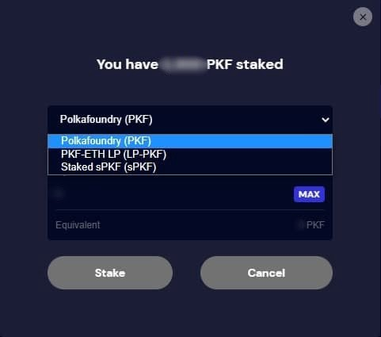

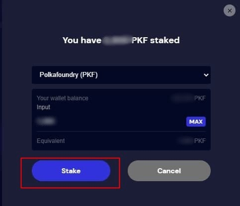

* Metamask will prompt you to confirm the transaction;
* After you confirm, you will see an option to view your transaction on Etherscan.

::: danger NOTE
Due to network congestion, your transaction could take some time. You may need to wait or consider speeding up your transaction.
:::

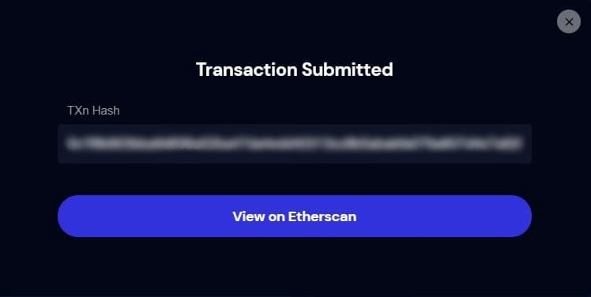

* Once the transaction is confirmed, you can verify your wallet balance and the obtained Tiers according to the token amount you staked and other regulations such as reputation multiplier, stake duration, and so on.

<h3> 2.3. Unstaking </h3>

* To unstake the token, click the **Unstake** button,
* Follow the same procedure for staking tokens.

::: danger NOTE
If you unstake tokens from Red Kite or sell your bought tokens early after token sales, it will affect your reputation multiplier.
:::

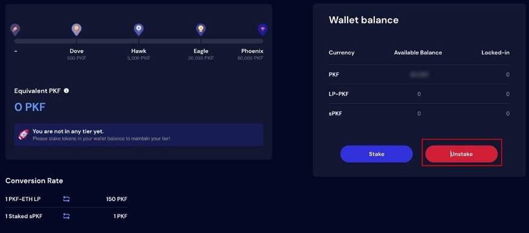

### III. HOW TO JOIN A POOL AND APPLY FOR WHITELIST

::: danger Note
Before joining a pool, make sure you have completed all the steps above.
:::

<h3> 3.1. Step 1: Choosing a pool </h3>

* Go to the Pool **Dashboard**;
* Choose the Pool you want to join, then open its details.

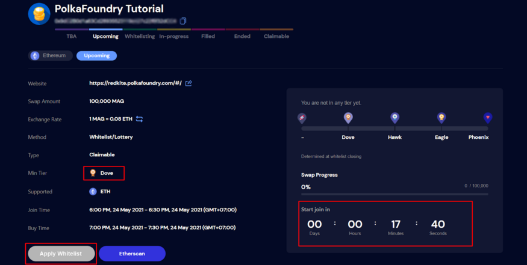

<h3> 3.2. Step 2: Apply for whitelist </h3>

* At the pool’s page, click the **Apply Whitelist** button;
* Fill in the Whitelist form to participate.

::: danger Note
You can activate the Apply Whitelist button only when you meet the minimum pool level and pass the KYC verification.
:::