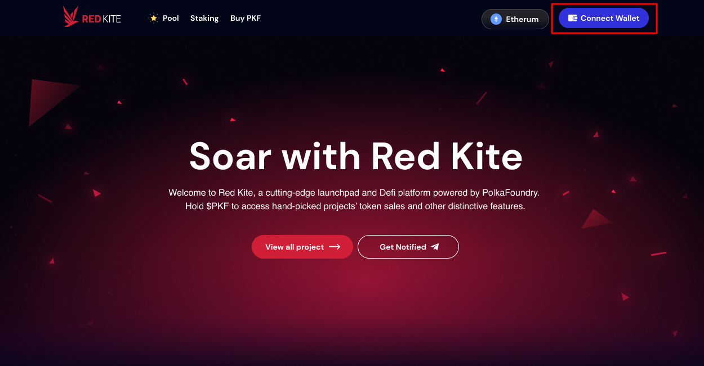
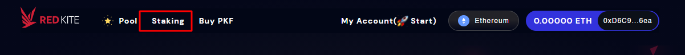

# I. How to join IDOs

---

:::warning NOTE
Follow the 4 steps below to join the IDOs on Red Kite: **Connect Wallet > Stake > KYC > Apply Whitelist**.
:::

## 1.1. Connect Wallet

* Go to [**https://redkite.polkafoundry.com**](https://redkite.polkafoundry.com).
* •	Click “Connect Wallet” button in the header to connect your wallet

* •	In the Connect Wallet popup window, choose the network among Ethereum, BSC and Polygon networks and the corresponding wallet you use.

   

## 1.2. Stake

You need to achieve one of Red Kite tiers (Dove, Hawk, Eagle, Phoenix) to be eligible to join the IDOs. To stake, please go to [https://redkite.polkafoundry.com/#/staking-pools](https://redkite.polkafoundry.com/#/staking-pools) or click “Staking” menu on the header. Click [here](https://redkite-faq.polkafoundry.com/guides/guide_staking.html#vi-staking) to view the detailed user guide of how to staking on Red Kite.

## 1.3. KYC

* After staking successfully, you can apply whitelist for joining the IDOs. 
* Go to the “Upcoming” area in Pool Dashboard, select the pool you want to join whitelist and open its details. 
* The system will ask you to KYC. Click “KYC Now” button. It will navigate you to Icetea Labs KYC on Blockpass.
* Fill in all the necessary information to complete the KYC process.
  * Your KYC’s status on Red Kite will be changed to "Verified” once you pass the KYC process successfully.
  * The email you use on Blockpass for KYC will be automatically reflected on Red Kite.

## 1.4. Apply Whitelist

* The Whitelist popup is shown after clicking “Apply Whitelist” button in Pool Detail.
* The requirements to join the whitelist are different for each pool and are decided by the project team.
* Before clicking “Submit” button on the popup, make sure that:
  * You have completed all tasks required by the project’s team according to your tier.
  * You have entered your Twitter and Telegram’s username.

:::warning NOTE
Please input your username of Twitter and Telegram like the following example.
* Your Twitter is https://twitter.com/PolkaFoundry -> Please input **@PolkaFoundry** in Your Twitter Account.
* Your Telegram is https://t.me/PolkaFoundry -> -> Please input **@PolkaFoundry** in Your Telegram Account.

* The system will verify your information after you click “Apply Whitelist” button.

:::warning IT'S DONE! YOU HAVE COMPLETED ALL THE STEPS TO JOIN THE IDOS ON RED KITE.
Now all you have to do is wait for the pool allocation to be announced.
:::