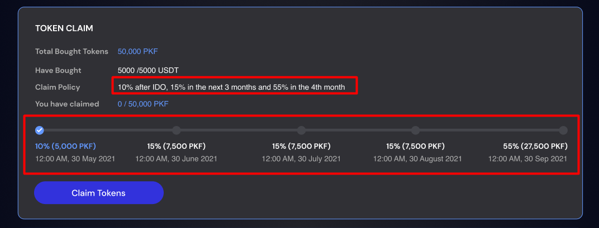

# III. How to Claim Tokens

---

* Once the pool swap time is over, you will be able to claim your tokens.
* Open the pool details and navigate to “Claim Token” area:
  * Total Bought Tokens: The total amount of tokens you have purchased
  * Have bought: Your amount spent / Your allocation
  * You have claimed: Tokens you have claim / Your total purchased tokens
  * Claim Policy: The claim policy is decided by the project team.  The milestones for claiming tokens are displayed according to the claim policy. You can refer to the example below.

  
  

  * Click “Claim Tokens” button to claim.  The button will be enabled when it reaches the token claim time.
  * Confirm the transaction on your wallet and you will get your tokens in your wallet shortly thereafter.
    * Make sure you have ETH or BNB in your wallet for the gas fee when claiming tokens.