# VI. Staking

---

## 6.1. How to Access

To access this feature, please follow these steps:
* Go to [https://redkite.polkafoundry.com](https://redkite.polkafoundry.com.).
* Click the “Staking” menu on the header of the screen.

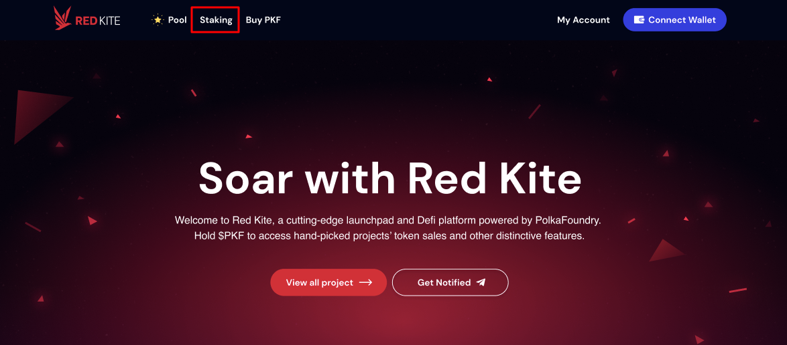

## 6.2. Overview

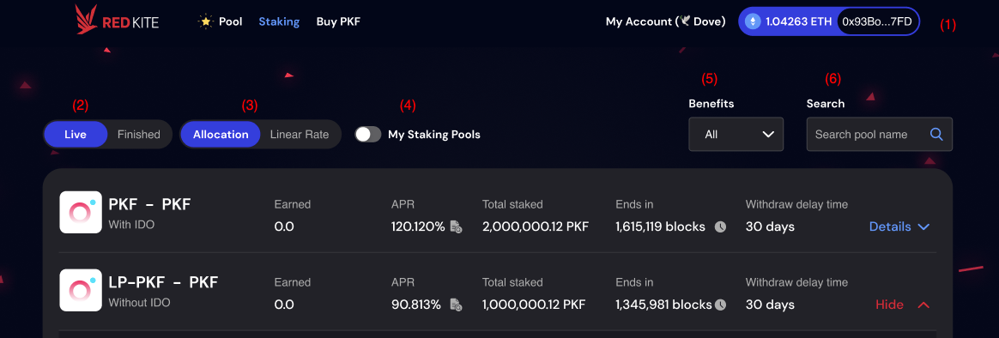

**(1) Connect Wallet & Network:**

* Staking does not require a minimum user tier, so all you have to do is connect to your wallet and join these pools.
* You must connect your Wallet and use Ethereum Network to join the staking pools.

**(2) Pool Statuses:** Switch the button to filter the staking pools by the status.

* Live: The staking pool is open and you can stake to earn rewards.
* Finished: The staking pool is closed and you can no longer join.

**(3) Pool Types:** Currently, users can only stake PKF or LP-PKF on Red Kite. Staking pools for IDO project tokens (multi-token staking pools) will be supported in the coming Q4. Switch the button to filter the staking pools by the pool type. There are 2 types of staking pools on Red Kite, which are :

* Allocation pool: Users will earn staking rewards each time a new block is created. The sooner and the higher your staking, the more rewards you earn.
* Linear Rate pool: Users will earn staking rewards based on the length of time the tokens remain locked.

**(4) My Staking Pools:** Activate this button to filter only the pools you are currently staking.

**(5) Benefits:** In addition to the type of pool, users can select a pool based on its benefits, which includes:

* **With IDO:** The amount of PKF or LP-PKF staked in these pools will be used to calculate your Red Kite tier and the number of Red Kite points you will own. Along with earning interest, staking into these pools entitles you to participate in IDOs on Red Kite.
* **Without IDO:** The PKF or LP-PKF staked in these pools will be used solely to calculate the interest you will receive from Red Kite following a staking period. They will not be used to determine your Red Kite tier or Red Kite points, implying that they will have no effect on your tier or eligibility to participate in IDO.
* You can filter the staking pools by selecting the options (All, With IDO, Without IDO) from the dropdown box.

**(6) Search:** You can search the staking pool by entering the name on the search box.

## 6.3. Allocation pool

### 6.3.1. General Information

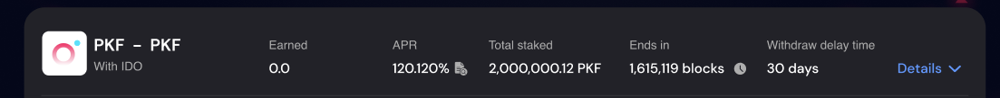

The allocation pool includes the following information.

* Stake Tokens - Earn Tokens: The token you use to stake and and the one you receive as rewards from the pool.

  E.g, LP-PKF - PKF: You stake LP-PKF and earn PKF as rewards.

* Benefit: You can check the benefit (With IDO or Without IDO) of pool.
* Earned: The current number of tokens you earn as staking rewards.  
* APR: Annual Interest Rate. Click the document icon on the right to view detailed information.

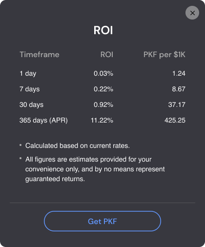

* Total staked: Total tokens staked in the pool (including your tokens and those of other users).
* Ends in: Countdown blocks until the pool is finished. Click the time icon on the right to view the block countdown time. 
* Withdraw delay time: The amount of time you must wait when unstaking tokens from the pool. When you unstake tokens:
  * The rewards you have earned up to the date you unstake your tokens will be transferred to your wallet address.
  * The system will stop to calculate your rewards.
  * After the delay time, you can receive the tokens you staked to your wallet address.

### 6.3.2. How to Stake

**STEP 1.** Select Live to filter the pools you can join and Click the Details button to view the detailed information of the pool.

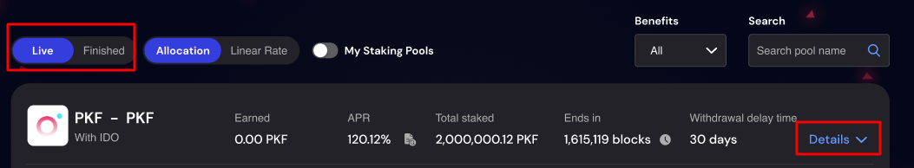

* The detail information of pool includes:
  * View Project Site: Click to view the website of the project.
  * View Contract: Click to view the pool contract.
  * Add to Metamask: Click to quickly add the token address to your Metamask Wallet.
  * Earned: The current number of tokens you earn as staking rewards.
  * Start Staking: Follow the below step to start staking.

**STEP 2.** Connect Wallet: Skip this step if you are already connected to your wallet on Red Kite.

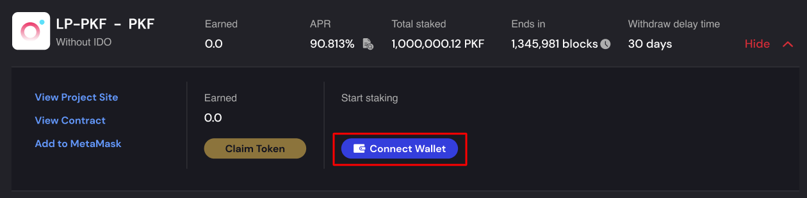

**STEP 3.** Activate pool: Click Enable button to join the pool. After enabling the pool by confirming the transaction on your wallet, you can simply stake your tokens in the pool. Skip this step if you have already enabled PKF.

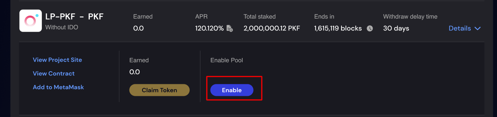

**STEP 4.** Stake:

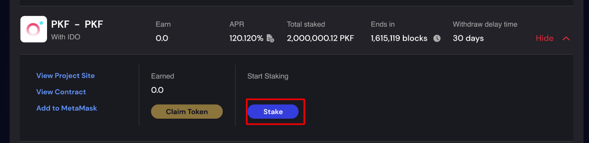

**CASE 1: Insufficient PKF or LP-PKF Balance**

The button is disabled if you do not have PKF or LP-PKF to stake. Click here to know more about how to get PKF or LP-PKF.

**CASE 2: Sufficient PKF or LP-PKF Balance**
* The Stake popup will appear after you click the **Stake** button.
* Enter the amount in (1) OR select % option (2) to determine the number of tokens you want to stake. 
* Click the Stake button to stake. It will connect you to your wallet address to confirm the transaction. 
* Click the **Get PKF** button if you want to purchase more PKF.

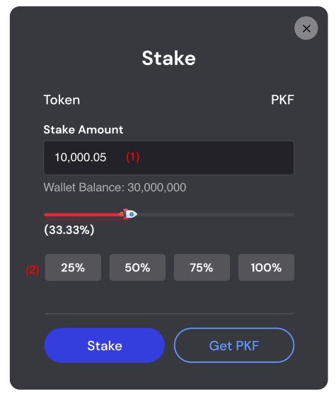

After staking successfully, you can see the number of tokens you staked and the stalking rewards.

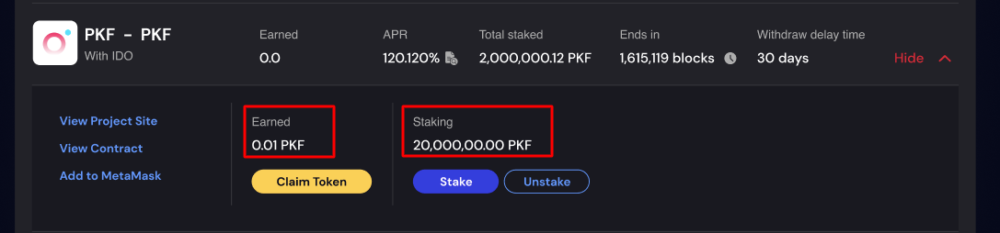

::: warning NOTE
For staking pools **with IDO** benefit, the staked numbers of PKF or LP-PKF will be used to calculate RKPs, which determine your tier on Red Kite. Go to My Account > My Tier menu to check your tier and your RKPs.
:::

### 6.3.3. How to Stake More

**STEP 1:** Open the pool you have already staked by clicking the Details button.

**STEP 2:** Click the Stake button to stake more tokens.

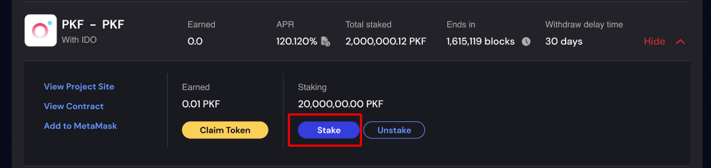

**STEP 3:** Enter the amount of tokens you want to stake more and click the Stake button on the popup. It will connect you to your wallet address to confirm the transaction.

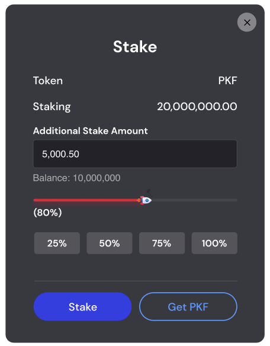

::: warning NOTE
* You can instantly claim the staking rewards accumulated up to the date you staked more tokens. Click Claim Token to claim staking rewards. (Refer to 6. 4.3 for more details)
* The new staking rewards are calculated from the date and time you staked more, and based on your new staked amount of PKF or LP-PKF, total tokens staked in pools, number of blocks etc.
:::

### 6.3.4. How to Claim Staking Rewards

**STEP 1:** Open the pool for which you want to claim rewards by clicking on the Details button.

**STEP 2.** Connect Wallet: Skip this step if you are already connected to your wallet on Red Kite.

**STEP 3:** Click Claim Token button, the Claim popup will appear. 

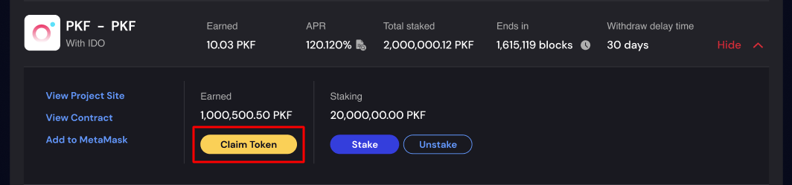

**STEP 4:** Click Claim button on the popup > Click Sign on your wallet to confirm the transaction. You can check the claimed rewards in your wallet after the transaction is mined successfully.

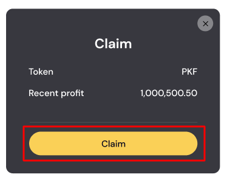

::: warning NOTE
Staking rewards will be reset to 0 after you have successfully claimed and continue to be calculated by your remaining staked amount.
:::

### 6.3.5. How to Unstake

For Allocation Pools, you can unstake tokens at any time but you must wait until the end of the delay time to withdraw your token. Follow the steps below to unstake your tokens. 

**STEP 1:** Open the pool details clicking on the **Details** button. 

**STEP 2:** Connect Wallet: Skip this step if you are already connected to your wallet on Red Kite.

**STEP 3:** Click the Unstake button, the Unstake popup will appear.

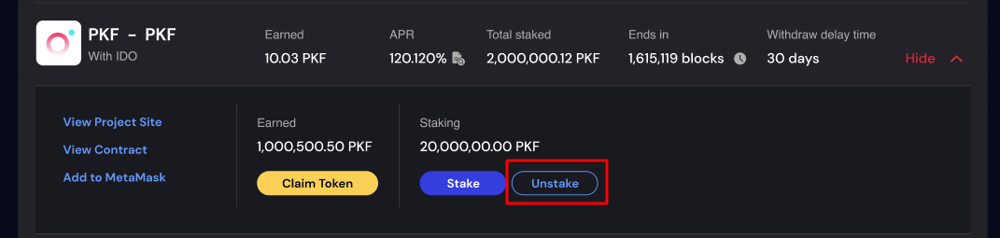

**STEP 4:** Enter the amount you want to unstake > Click **Claim and Unstake** button on the popup > Click **Sign** on your wallet to confirm the transaction.

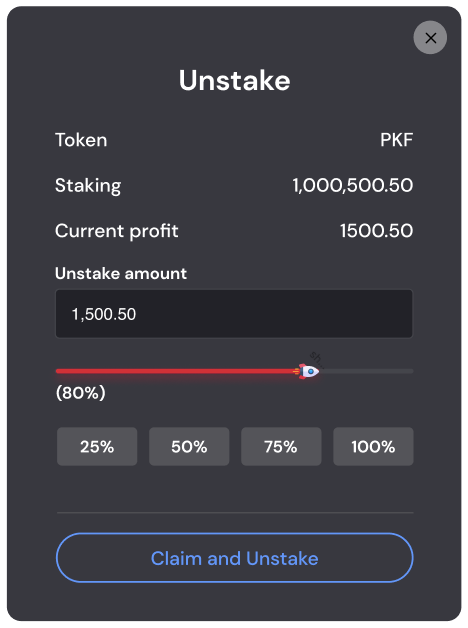

After confirming the transaction, your staking information will be updated accordingly in the details of the staking pool as below:

**CASE 1: If you unstake 100% of your staked tokens.**

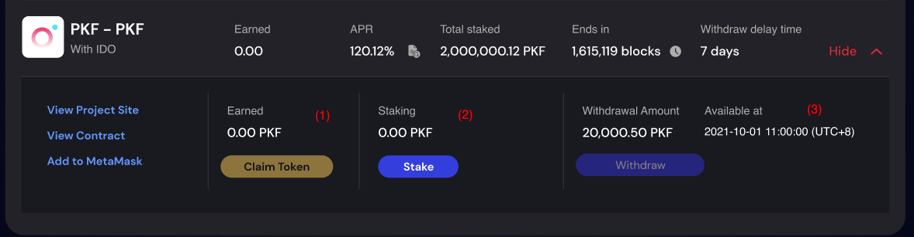

(1) The staking rewards you have earned up to the date you unstake your tokens will be transferred to your wallet address. In the “Earned” area of pool detail, the staking rewards are reset to 0.

(2) Staking: The amount remaining after you unstaked.

(3) Withdrawal Amount & Available at: The amount you unstaked and the date and time you can withdraw it. The **Withdraw** button is disabled until it reaches the date time you can withdraw tokens.

**CASE 2: If you do not unstake 100% of your staked tokens.**

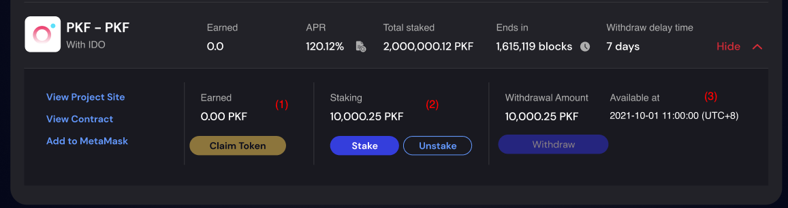

(1) The staking rewards you have earned up to the date you unstake your tokens will be transferred to your wallet address. In the “Earned” area of pool detail, the staking rewards are continuously calculated by your remaining staked amount.

(2) Staking: The amount remaining after you unstaked. If you continue to unstake, the confirm popup will appear when you click the **Unstake** button again.

When you continue to unstake, the withdrawal delay time will be extended, starting from the last date and time you unstaked, whether or not you have any tokens pending withdrawal.

Example:
* Withdrawal delay time: 7 days
* On 2021-09-01 11:00:00 (UTC+8), you unstaked your tokens -> You can withdraw your tokens on 2021-09-08 11:00:00 (UTC+8)
* But On 2021-09-03 12:30:00 (UTC+8), you continued to unstake your tokens -> The withdrawal delay time extended to 2021-09-09 12:30:00 (UTC+8).
* Withdrawal Amount & Available at: The amount you unstaked and the date and time when you can withdraw it. The **Withdraw** button is disabled until it reaches the date time you can withdraw tokens.

**STEP 5:** When the withdrawal delay time is over, click the Withdraw button to receive your tokens in your wallet. Be sure to click Sign on your wallet to confirm the transaction. 

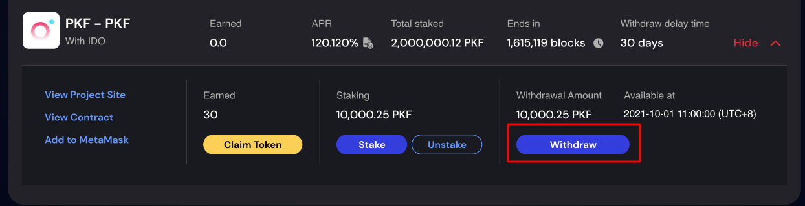

::: warning NOTE
The amount of PKF or LP-PKF used to calculate your Red Kite tier and the number of Red Kite points  will be deducted when you unstake tokens from the staking pool **with IDO** benefit.
:::

## 6.4. Linear rate pool

### 6.4.1. General Information

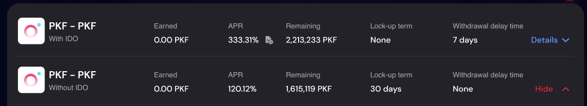

The allocation pool includes the following information. 
* Stake Tokens - Earn Tokens: The token you use to stake and and the one you receive as rewards from the pool.

  E.g, LP-PKF - PKF: You stake LP-PKF and earn PKF as rewards. 

* Benefit: You can check the benefit (With IDO or Without IDO) of pool.
* Earned: The current number of tokens you earn as staking rewards.  
* APR: Annual Interest Rate. Click the document icon on the right to view detailed information.
* Remaining: Remaining tokens until the pool is full.
  * For pools that do not limit the number of tokens to be staked, the remaining is displayed as as “-”
  * For pools that limit the number of tokens to be staked, the remaining tokens = Total pool amount - Total tokens staked by users.
* Lock-up term: The length of time the tokens remain locked. Current terms on Red Kite are: 3 months, 6 months, 1 year and None (No time limit).
* Withdraw delay time: This time is **only** applied for Linear Rate Pool with lock-up term as None. It’s the amount of time you must wait when unstaking tokens from the pool. 
When you unstake tokens:
  * The rewards you have earned up to the date you unstake your tokens will be transferred to your wallet address.
  * The system will stop to calculate your rewards.
  * After the delay time, you can receive the tokens you staked to your wallet address. 

### 6.4.2. How to Stake

**STEP 1:** Select Live to filter the pools you can join and Click the **Details** button to view the detailed information of the pool.

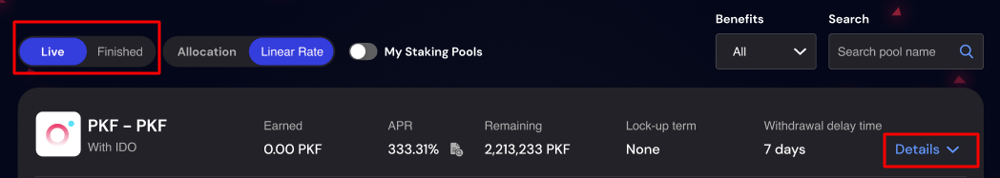

The detail information of pool includes:
* Total Pool Amount: The maximum number of tokens can be staked in the pool. The text “Unlimited” is displayed if the pool does not limit the number of tokens to be staked. 
* Progress Bar: Describes Total tokens staked by users / Total Pool Amount
* Start Join Time: Start time to join this pool
* End Join Time: End time to join this pool. 
* Stake amount (Min): Minimum number of tokens you need to stake
* Stake amount (Max): Maximum number of tokens you can stake

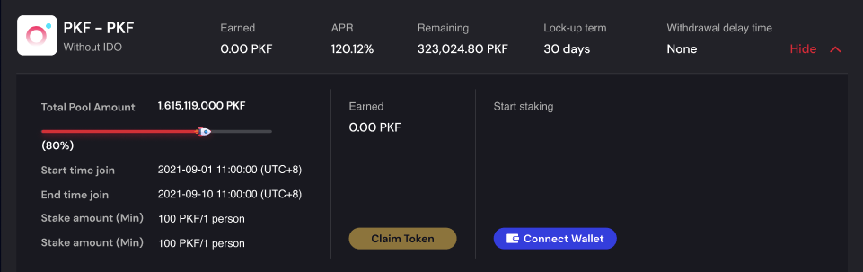

**STEP 2.** Connect Wallet: Skip this step if you are already connected to your wallet on Red Kite.

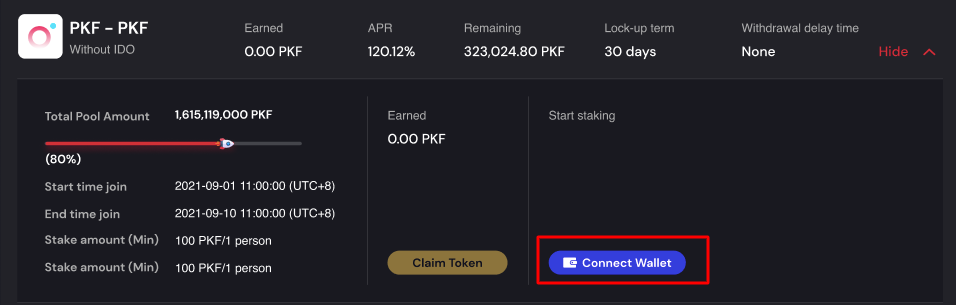

**STEP 3.** Activate pool: Click **Enable** button to join the pool. After enabling the pool by confirming the transaction on your wallet, you can simply stake your tokens in the pool. Skip this step if you have already enabled PKF.

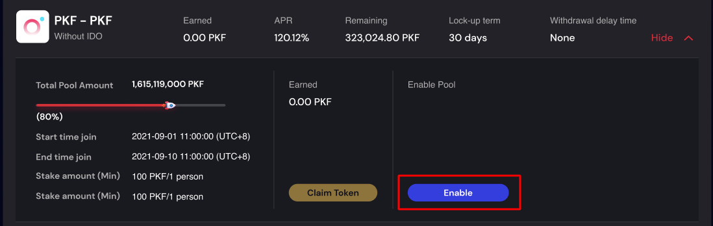

**STEP 4.** Stake:

**CASE 1: Insufficient PKF or LP-PKF Balance**

The button is disabled if you do not have PKF or LP-PKF to stake. Click here to know more about how to get PKF or LP-PKF. 

**CASE 2: Sufficient PKF or LP-PKF Balance**
* The Stake popup will appear after you click the **Stake** button.
  * Enter the amount in (1) OR select % option (2) to determine the number of tokens you want to stake. Please pay attention to the minimum and maximum stake amount/1 person.
  * Click the Stake button to stake. It will connect you to your wallet address to confirm the transaction.
  * Click the **Get PKF** button if you want to purchase more PKF.

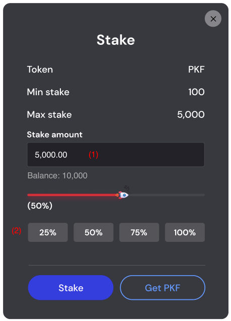

After staking successfully, you can see the number of tokens you staked and staking rewards.
* Linear Rate pool with no limit of lock-up term:

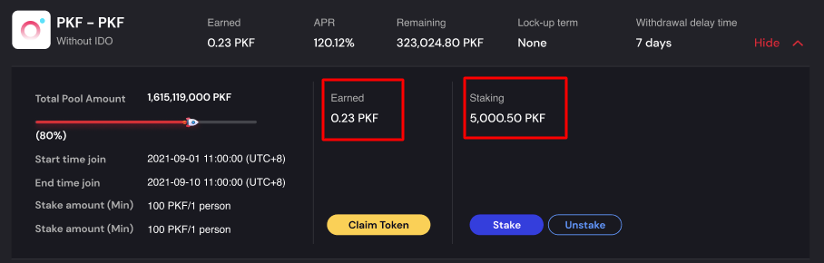

* Linear Rate pool with lock-up term (3 months, 6 months, 1 year):
  * Expiry Date: = The date time you staked + The lock-up term. You can claim staking rewards after this time.
  * Estimated profit: The estimated staking rewards you will receive after the expiry date, based on the current APR and the number of PKF or LP-PKF you staked in the pool.

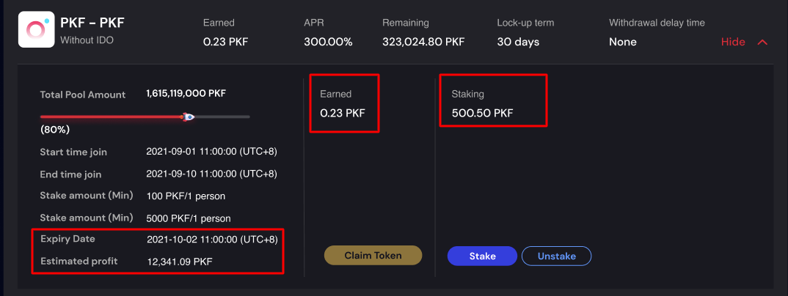

::: warning NOTE
For staking pools **with IDO** benefit, the staked numbers of PKF or LP-PKF will be used to calculate RKPs, which determine your tier on Red Kite. Go to My Account > My Tier menu to check your tier and your RKPs.
:::

### 6.4.2. How to Stake More

**STEP 1:** Open the pool you have already staked by clicking the **Details** button.

**STEP 2:** Click the Stake button to stake more tokens.

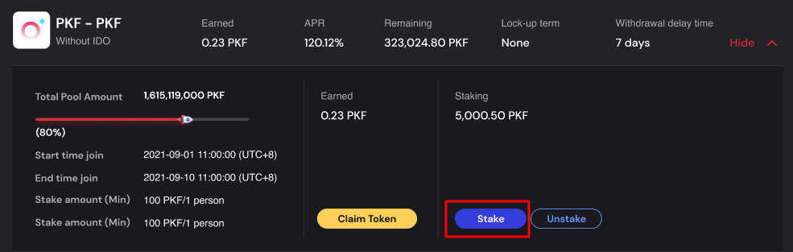

**STEP 3:** Enter the amount of tokens you want to stake more and click the **Stake** button on the popup. It will connect you to your wallet address to confirm the transaction.

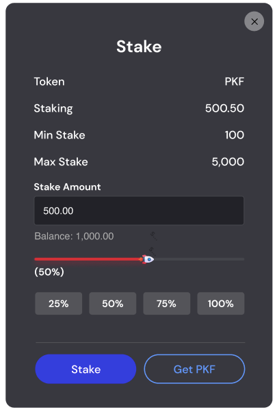

::: warning NOTE
** 1. For Linear Rate pool with no lock-up term:**
* You can instantly claim the staking rewards accumulated up to the date you staked more tokens. Click Claim Token to claim staking rewards. (Refer to 6. 4.3 for more details)
* The new staking rewards are calculated from the date and time you staked more, and based on your new staked amount of PKF or LP-PKF.

**2. For Linear Rate pool with lock-up term (3 months, 6 months, 1 year)**
* The expiry date will be extended from the date and time you staked more PKF or LP-PKF. A confirmation popup will appear after you click the Stake button as below.

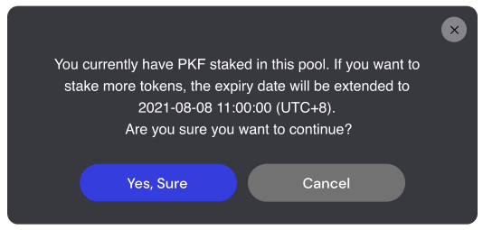

* After you click **Yes, Sure** to confirm, you can instantly claim the staking rewards accumulated up to the date you staked more tokens. Click Claim Token to claim staking rewards. (Refer to 6. 4.3 for more details).
* The new staking rewards are calculated from the date and time you staked more, and based on your new staked amount of PKF or LP-PKF.
:::

### 6.4.3. How to Claim Staking Rewards

**STEP 1:** Open the pool for which you want to claim rewards by clicking on the **Details** button. 

**STEP 2.** Connect Wallet: Skip this step if you are already connected to your wallet on Red Kite.

**STEP 3:** Click **Claim Token** button, the Claim popup will appear.

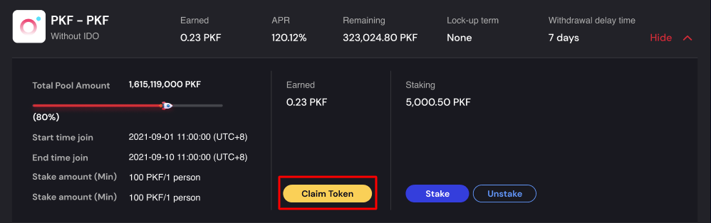

:::warning NOTE
You can claim rewards in the following cases:

**1. Linear Rate pool with no lock-up term:**
* You can claim the rewards at any time after successfully staking.
* The staking rewards will be reset to 0 and will continue to be calculated from the date and time you successfully claimed tokens.

**2. For Linear Rate pool with lock-up term (3 months, 6 months, 1 year)**
* You claim the staking rewards accumulated up to the date you staked more tokens. Refer to 6.4.2 for more details. OR
* You can claim all of your staking rewards after the expiry date.
:::

**STEP 4:** Click Claim button on the popup > Click Sign on your wallet to confirm the transaction. You can check the claimed rewards in your wallet after the transaction is mined successfully.

### 6.4.4. How to Unstake

#### 6.4.4.1. Linear Rate pool with no lock-up term

You can unstake at any time, but you must wait until the end of the delay time to withdraw your token. Follow the steps below to unstake your tokens.

**STEP 1:** Open the pool details clicking on the Details button. 

**STEP 2:** Connect Wallet: Skip this step if you are already connected to your wallet on Red Kite.

**STEP 3:** Click the Unstake button, the Unstake popup will appear.

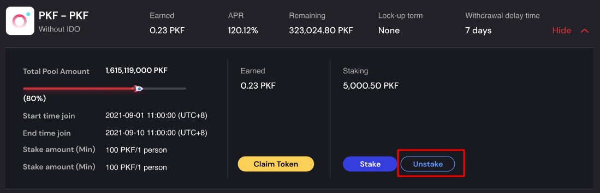

**STEP 4:** Enter the amount you want to unstake > Click **Claim and Unstake** button on the popup > Click **Sign** on your wallet to confirm the transaction.

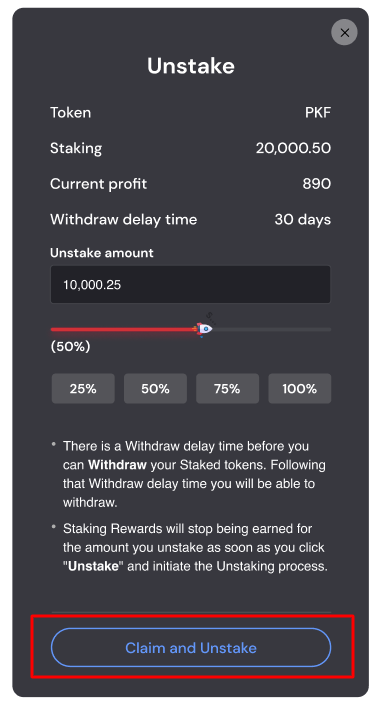

After confirming the transaction, your staking information will be updated accordingly in the details of the staking pool as below:

**CASE 1: If you unstake 100% of your staked tokens.**

(1) The staking rewards you have earned up to the date you unstake your tokens will be transferred to your wallet address. In the “Earned” area of pool detail, the staking rewards are reset to 0.

(2) Staking: The amount remaining after you unstaked.

(3) Withdrawal Amount & Available at: The amount you unstaked and the date and time you can withdraw it. The **Withdraw** button is disabled until it reaches the date time you can withdraw tokens.

**CASE 2: If you do not unstake 100% of your staked tokens.**

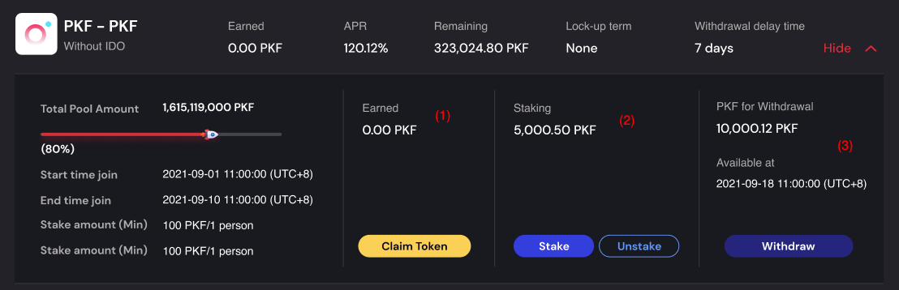

(1) The staking rewards you have earned up to the date you unstake your tokens will be transferred to your wallet address. In the “Earned” area of pool detail, the staking rewards are continuously calculated by your remaining staked amount.

(2) Staking: The amount remaining after you unstaked. If you continue to unstake, the confirm popup will appear when you click the **Unstake** button again.

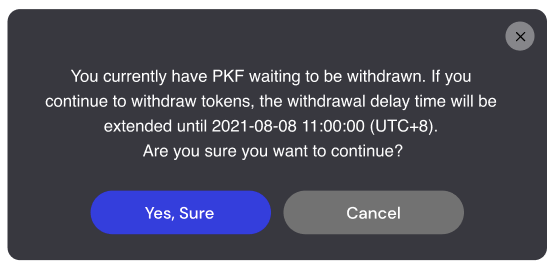

When you continue to unstake, the withdrawal delay time will be extended, starting from the last date and time you unstaked, whether or not you have any tokens pending withdrawal.

Example:
* Withdrawal delay time: 7 days
* On 2021-09-01 11:00:00 (UTC+8), you unstaked your tokens -> You can withdraw your tokens on 2021-09-08 11:00:00 (UTC+8)
* But On 2021-09-03 12:30:00 (UTC+8), you continued to unstake your tokens -> The withdrawal delay time extended to 2021-09-09 12:30:00 (UTC+8). 

(3) Withdrawal Amount & Available at: The amount you unstaked and the date and time when you can withdraw it. The Withdraw button is disabled until it reaches the date time you can withdraw tokens.

**STEP 5:** When the withdrawal delay time is over, click the Withdraw button to receive your tokens in your wallet. Be sure to click Sign on your wallet to confirm the transaction.

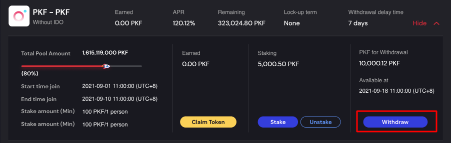

#### 6.4.4.2. Linear Rate pool with lock-up term (3 months, 6 months, 1 year)

You can only unstake when it reaches the Expiry Date.

**STEP 1:** Open the pool details clicking on the **Details** button. 

**STEP 2:** Connect Wallet: Skip this step if you are already connected to your wallet on Red Kite.

**STEP 3:** Click the Unstake button, the Unstake popup will appear.

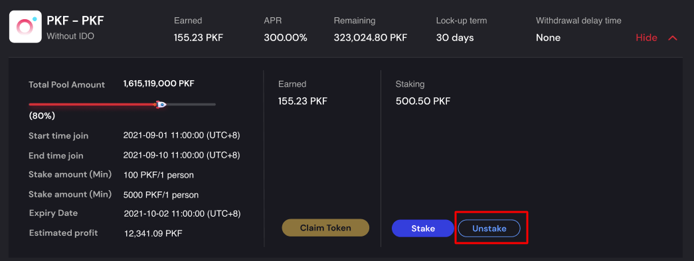

**STEP 4:** Enter the amount you want to unstake > Click Claim and Unstake button on the popup > Click Sign on your wallet to confirm the transaction.

:::warning NOTE
1. There is no withdrawal delay time for Linear Rate pool with lock-up term (3 months, 6 months, 1 year).

2. When it reaches the expiry date, you should unstake tokens since both of the unstaked amount and the staking rewards you have earned up to the expiry date will be transferred to your wallet address. Meanwhile, if you choose to claim rewards (by clicking the **Claim Token** button), only the staking rewards will be transferred to your wallet address.

3. Staking Rewards will stop being earned once it reaches the expiry date. We recommend that you unstake 100% of your tokens when it reaches the expiry date.

