# V. My Account

---

## 5.1. How to access & Network

* Go to [https://redkite.polkafoundry.com](https://redkite.polkafoundry.com).
* Click “Pool” or “View All Projects” to view the Pools Dashboard.

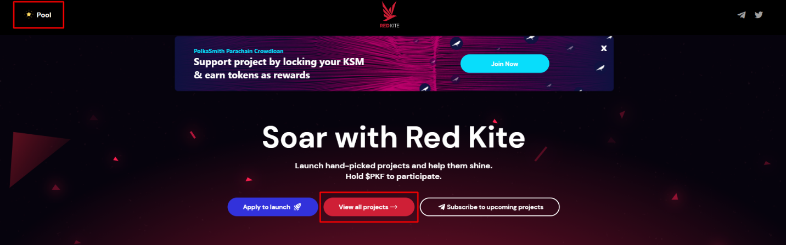

* Click on “My Account” in the header after connecting your wallet address.

* The “My Account” menu includes 4 sub-menus: My Profile, My Tier, My Pool, and Need Help. 
* You need to use the Ethereum Network to use the “My Account” Menu. To switch to Ethereum Network, please change the network on your wallet, the network on Red Kite will be updated accordingly.

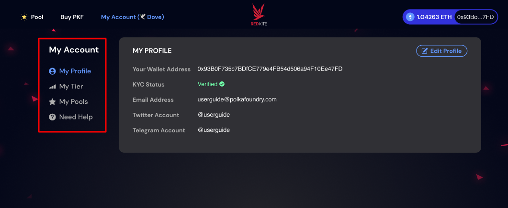

## 5.2. My Profile

* You can view your profile information and update your Twitter and Telegram accounts in the “My Profile” menu. 
* You cannot update your profile information if your KYC status is “Unverified”. Please refer to [**1.1. Register Account**](/guides/before-joining-idos.html#_1-1-register-account) to complete the account registration.

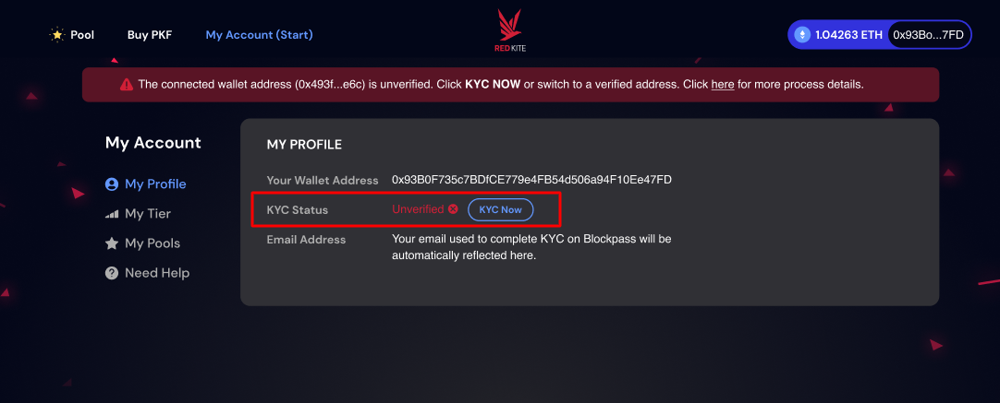

* Click “Edit Profile” button on the upper right corner to update your Twitter and Telegram accounts.

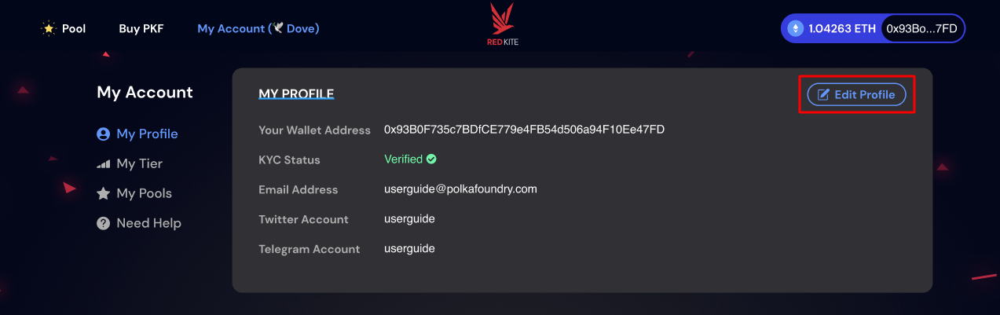

* Enter or update your Twitter and Telegram account then click “Update Profile” to save your latest information.
  * You do not need to enter “@” symbol in front of your Twitter and Telegram account name
  * The accounts you have updated in the “My Profile” menu will be used every time you join the pool whitelist on Red Kite. For Dove and Hawk tiers, the system will verify the social requirements requested by each pool with your entered accounts. Therefore, make sure to enter your accounts correctly. You can read more about the Whitelist Application process [here](https://redkite-faq.polkafoundry.com/guides/before-joining-idos.html#_1-4-2-step-2-click-apply-whitelist).

* You will see the message "Your profile has been successfully updated" in the header after updating your latest information.

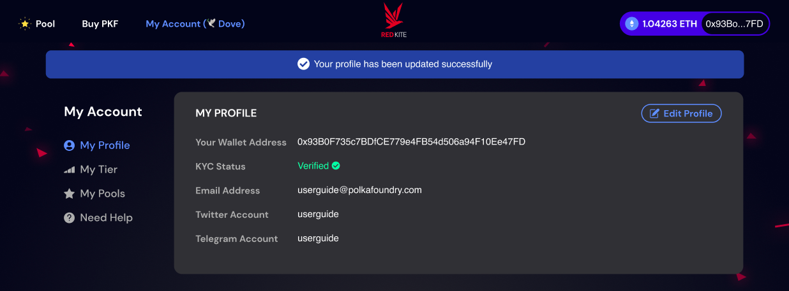

## 5.3. My Tier

### 5.3.1. Summary

* “My Tier” menu will allow you to check your Tier, Red Kite points information, Tier Benefits as well as to stake or unstake to update your tier.
* You can see the summary information in the upper part of the My Tier screen.
  * **Your Tier:** Your current tier. Click the “Tier Benefits” tab to check the policies and benefits of the four tiers, Phoenix, Eagle, Hawk, and Dove, on the Red Kite launchpad.
  * **Total Red Kite Points (RKPs):** The total number of Red Kite points you own. Your tier on Red Kite is determined by this number. Red Kite points can be earned through the following ways:
    * (1) Staking PKF, PolkaFoundry native token, on Red Kite. Each staked PKF will earn 1 Red Kite point.
    * (2) Adding PKF-ETH to Uniswap liquidity pool to get LP-PKF, then staking them to Red Kite. Each staked LP-PKF will earn 800 Red Kite points.
    * (3) Contributing KSM, Kusama native token, to PolkaSmith’s crowdloan on Red Kite. Each locked KSM will earn 500 Red Kite points. (Click [here](https://medium.com/polkafoundry/polkasmith-kusama-parachain-auction-in-a-nutshell-e73892169719) to know more about the reward policies for KSM contributors).
    * (4) Earning Reputation by staking PKF or LP-PKF on Red Kite. Reputation is the number of Red Kite points given to loyal launchpad users, calculated by the Reputation multiplier (Click [here](https://medium.com/polkafoundry/users-reputation-system-on-red-kite-feb4b4890df0) to know more about User’s Reputation System on Red Kite).
  * **Point left to next tier:** The remaining RPKs you need to reach the next tier.

    For example: Your current tier is Dove and you have 1,000 RPKs -> You need 4,000 RPKs to achieve the Hawk Tier.

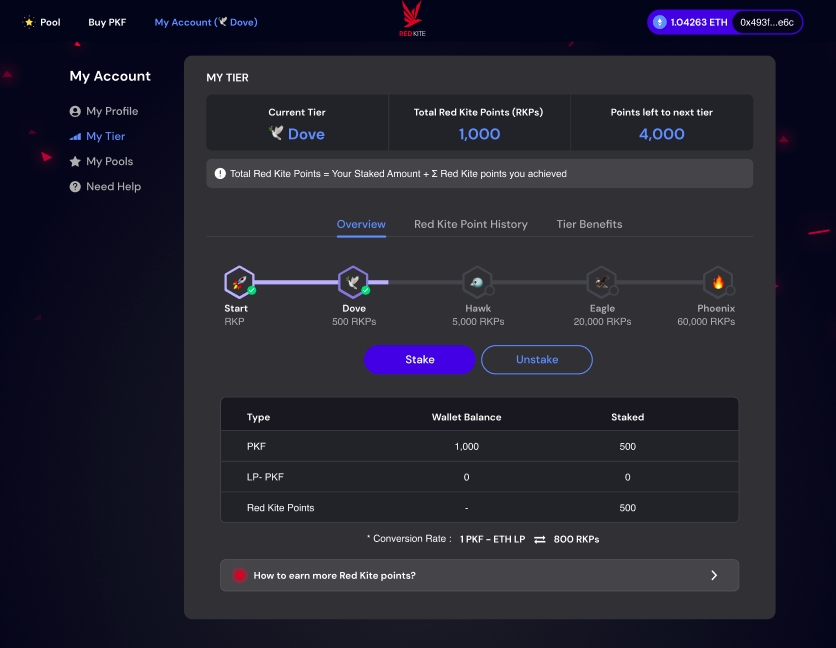  

### 5.3.2. Overview

* In the “Overview” tab, you can:
  * (1) Check the Tier Progress Bar.
  * (2) Stake / Unstake to update your token. Click [here](https://redkite-faq.polkafoundry.com/guides/before-joining-idos.html#_1-3-stake-unstake) for the guide of Stake / Unstake Flow on Red Kite.
  * (3) Check your staked amount of PKF or LP-PKF and your Red kite points you have earned through the KSM Contribution and User’s Reputation System. The “Total Red Kite Points (RPKs) is the sum of “Staked” column.
  * (4) “How to earn more Red Kite points” more about the Red Kite points.

### 5.3.3. Red Kite Point History
* You can check the history of the Red kite points you have earned through the KSM Contribution and User’s Reputation System in this tab.

  * (1) From KSM Contribution: The number of RKPs you earned through contributing KSM to PolkaSmith’s crowdloan.

  * (2) From Staking Transactions: The number of RKPs calculated by the Reputation multiplier. You can check how many Red Kite points you have earned for each transaction in the transaction list table. (Click [here](https://medium.com/polkafoundry/users-reputation-system-on-red-kite-feb4b4890df0) to know more about the User's Reputation System on Red Kite).

  * (3) Total earned points: The total number of RKPs from KSM Contribution and Staking Transaction.

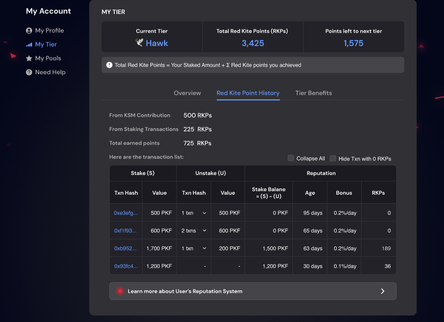

* All the transactions you have made to Red Kite are listed in the transaction list table
  * **Stake (S):** List all the PKF or LP-PKF stake transactions and their values.
  * **Unstake (U):** List all the unstake transactions and their values. When you unstake tokens on Red Kite, the system nullifies the Red Kite points awarded for staking, starting from the oldest tokens (or the tokens derived from the earliest Tx hash).
    * Click the arrow “v” to view the details of unstake transactions. Click the arrow again to collapse. 
    * Unstake Transaction Hash: Click the Txn hash to view the transaction on Etherscan or BSCscan.
    * Nullified Value / Unstake Value: The PKF amount to be nullified starting from the oldest tokens / The value of the Unstake Transaction
    * Remaining Unstake Value: = [Unstake Value] - [Nullified Value]

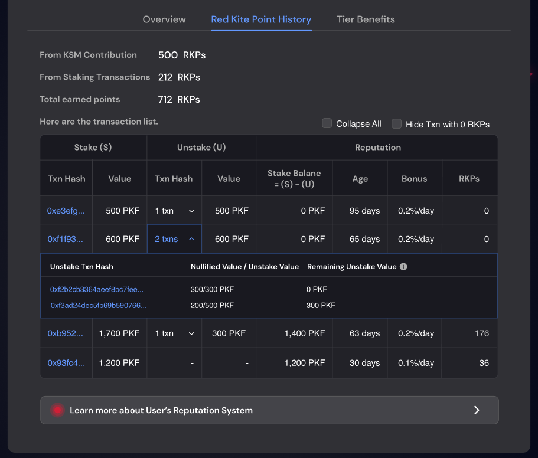

**Example:** Please refer to the below captured image.

* The 1st row of the table: When you unstake tokens, the system nullifies the Red Kite points awarded for staking, starting from “0xe3efg...” which is the oldest Stake Transaction.
  * Stake value: 500 PKF
  * Unstake value: 500 PKF
  * Stake Balance: = Stake value - Unstake value = 500 - 500 = 0 PKF

    **--> You get 0 RPKs. All the RKPs awarded for the “0xe3efg...” Stake Transaction are nullified.**

* The 2nd row of table: You continue to stake 600 PKF on Red Kite (“0xf1f93…” Stake Transaction) then you unstake twice:
  * “0xf2b2cb3364aeef8bc7fee...” Unstake Transaction: You unstake 300 PKF
    * The nullified amount: 300 PKF / 300 PKF
    * Stake Balance: = Stake value – Unstake Value = 500 - 300 = 200 PKF

      **--> The remaining stake value of “0xf1f93…” Stake Transaction, which is used to calculate RPKs, is 200 PKF.**
  * You continue to unstake 500 PKF with “0xf3ad24dec5fb69b590766...” Unstake Transaction.
    * The nullified amount: 200 PKF (Since the remaining value of “0xf1f93…” Stake Transaction is only 200 PKF) 
    * Stake balance: Stake value – Unstake Value = 200 - 200 = 0 PKF

    **--> You get 0 RPKs. All the RKPs awarded for the “0xe3efg...” Stake Transaction are nullified.**

    **--> Since the unstake value is 500 PKF → The remaining 300 PKF unstake value is deducted from the next oldest transaction, which is “0xb952” Stake Transaction (on the 3rd row)**

* **(3) Reputation:**
  * **Stake Balance = (S) – (U):** The stake value – The unstake value. This final value is used to calculate RKPs you earn through the User's Reputation System.
  * **Age:** The age of a token is calculated from the time it is generated according to its transaction hash (the Tx hash), also known as the transaction ID (TxID). The maximum Reputation calculation duration is 90 days. The first day that tokens (PKF, LP-PKF) are staked on Red Kite is counted as day 0.
  *  **Bonus:** The Reputation calculation multiplier. The longer the token is locked, the higher the Reputation calculation multiplier will be, specifically as follows:

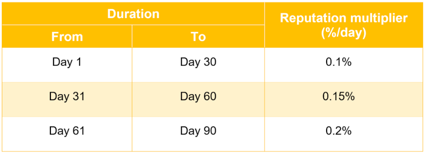

  *  **RKPs:** The RKPS you earn for each transaction = Age * Stake Balance * Bonus

* (4) **Learn more about User’s Reputation System”:** Click the button to learn more about User’s Reputation System on Red Kite

### 5.3.4. Tier Benefits

* You can check the policies and benefits of the four tiers, Phoenix, Eagle, Hawk, and Dove, on the Red Kite launchpad in the “Tier Benefits” tab. Click [here](https://medium.com/polkafoundry/new-tier-policy-updates-for-red-kite-launchpad-2b8a1d0c1fac) to read more about the Red Kite Tier Policy.

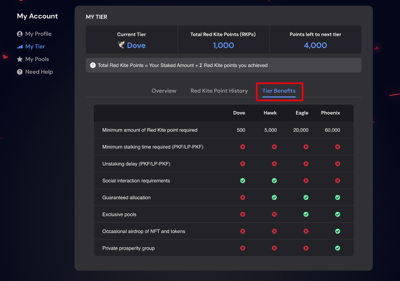

## 5.4. My Pool

### 5.4.1. Overview

* With the "My Pool" menu, you can easily keep track of the pools you have participated in and filter them by statues. The new features "Cancel Whitelist" and "Pre-Order" have been added to better support and benefit users.

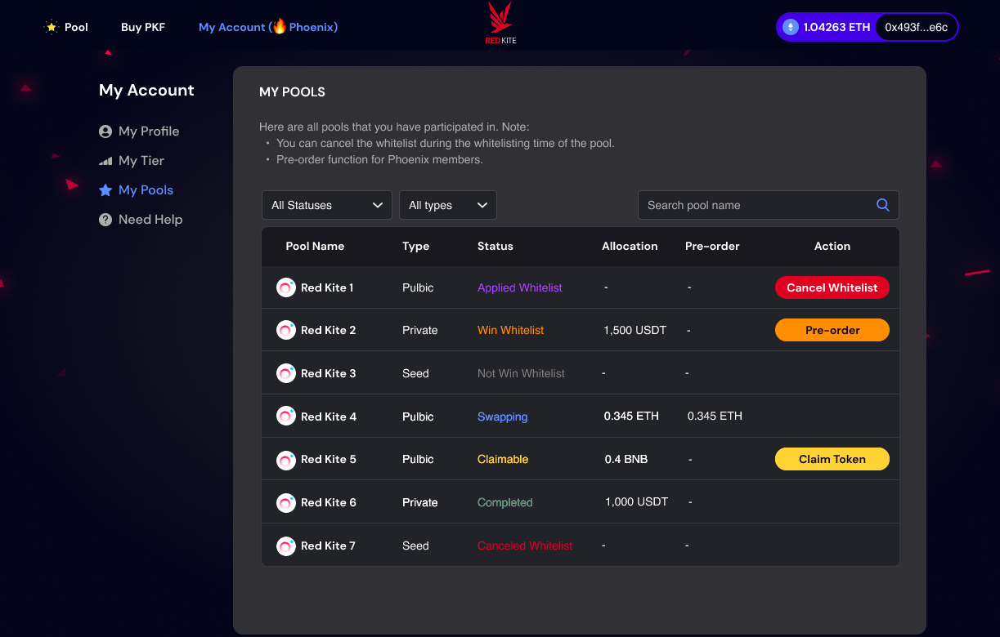

* There are 7 statuses as shown in the following table:

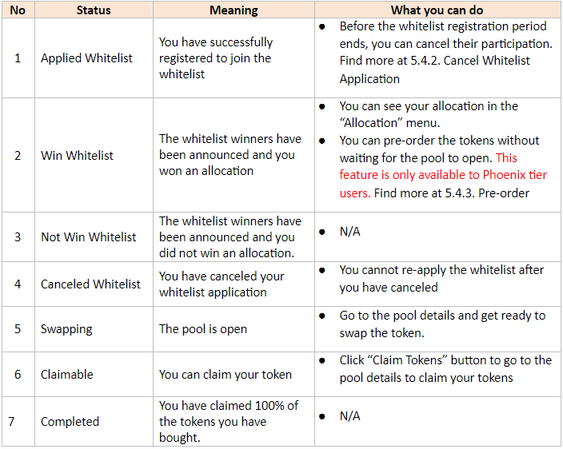

### 5.4.2. Cancel Whitelist Application

* Before the whitelist registration period ends, users who have successfully registered to join the whitelist can cancel their participation.

* Click the “Cancel Whitelist” button in the “Action” column > The Cancel Whitelist popup will appear.

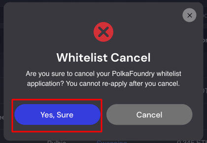

* Click “Yes, Sure” button to cancel your whitelist application. 
  * You cannot re-apply the whitelist after you have canceled. 
  * The “Apply Whitelist” button is no longer displayed in the pool detail.

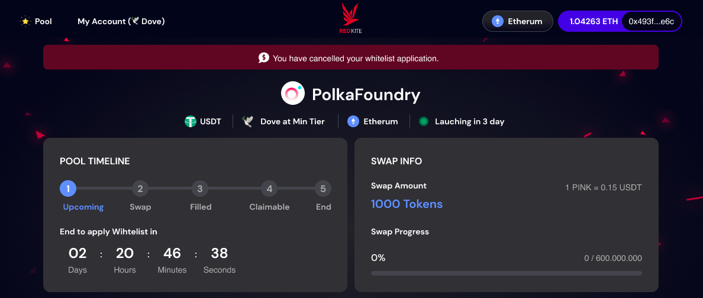

### 5.4.3. Pre-order for Phoenix tier

* This feature is only available for Phoenix tier users.
* Users can plan ahead with the token pre-order service rather than waiting for the sale to purchase tokens. As a result, users can place an order for the desired number of tokens based on the announced allocation and prepayment without waiting for the pool to open.
* To access the pre-order feature, you can choose one of the following two ways:
  * Go to “My Pool” of “My Account” menu, click the “Pre-order” button of the pool you want to pre-order
  * Go to “Pool Dashboard”, select the pool you want to pre-order and open its details.

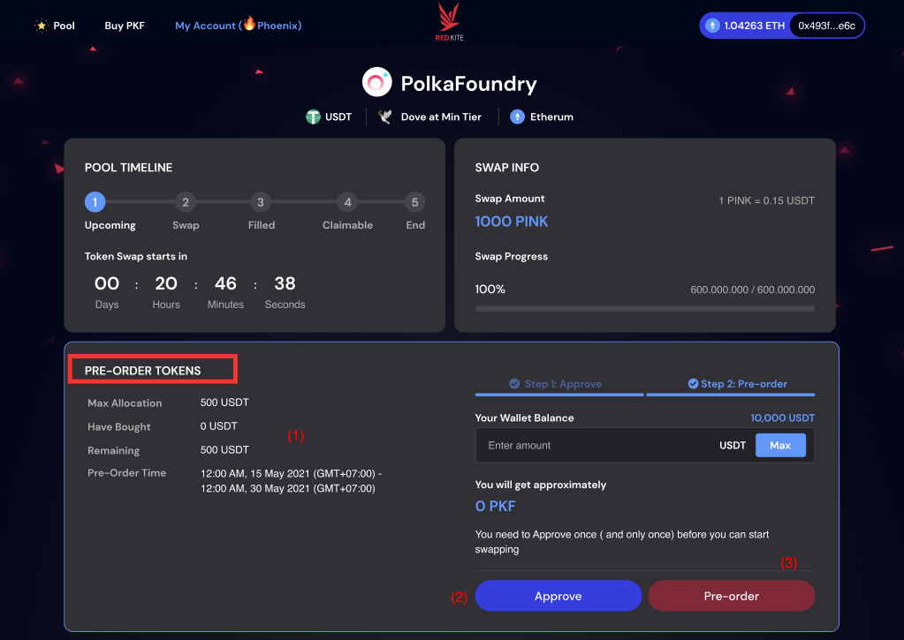

* You can see the “Pre-order Tokens” area in the pool details. The flow of pre-order tokens is the same as the one of Swap Token. (Click [here](https://redkite-faq.polkafoundry.com/guides/swap.html#_2-2-step-1-approve) to learn more about how to swap tokens).
  
  * (1) Check your Allocation information & Pre-order time.

  * (2) You need to Approve once (and only once) before you can start pre-order (For pools using ETH or BNB (native tokens), this step is skipped).

  * (3) Enter the amount you want to pre-order based on your allocation and click the “Pre-order” button.

* After successfully pre-ordering the tokens:
  * The “You have successfully pre-ordered the tokens” message is displayed in the header of pool details.
  * The number of pre-ordered tokens and your allocation are updated on “Pre-order tokens” and “Token Claim” areas in the pool details as well as on the “Pre-order” column in “My Pool” menu.

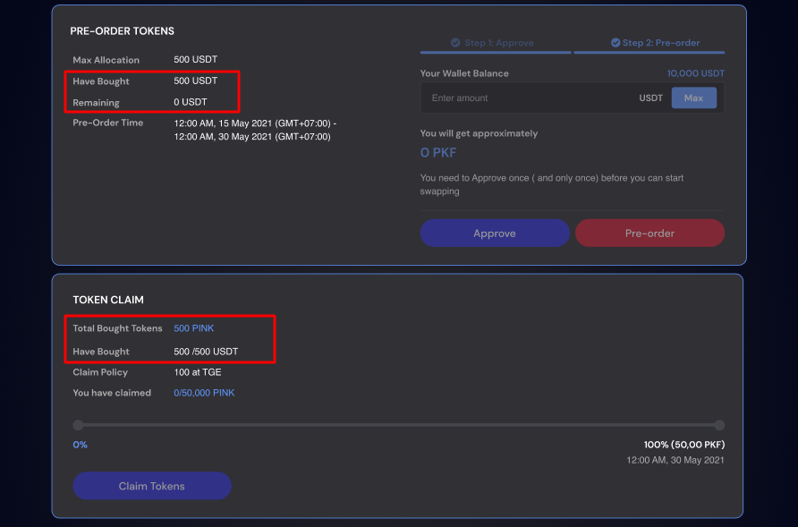

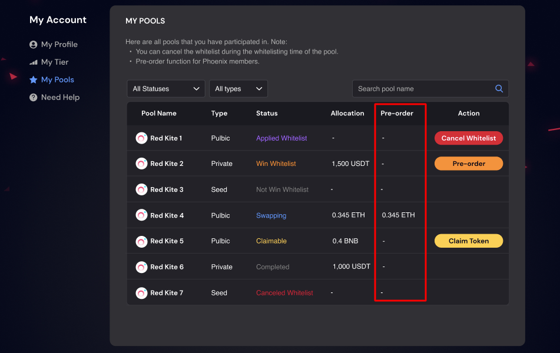

## 5.5. Need Help

* If you have any questions or need instructions on how to use the features of Red Kites, please click on the “Need Help” menu on the left side of the screen. There you will find the Red Kite Support Email (support@polkafoundry.com), Guide and Frequently Asked Questions.
* We also built the Red Kite Help Center for users to easily follow the guideline and find answers to questions related to using Red Kite at https://redkite-faq.polkafoundry.com/. We will regularly update its content and frequently ask questions.

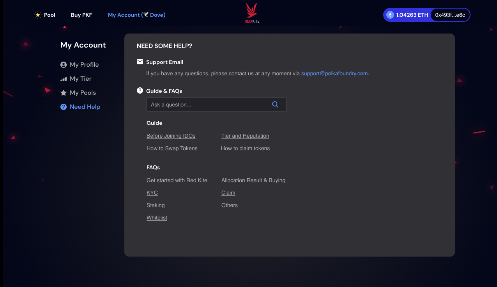