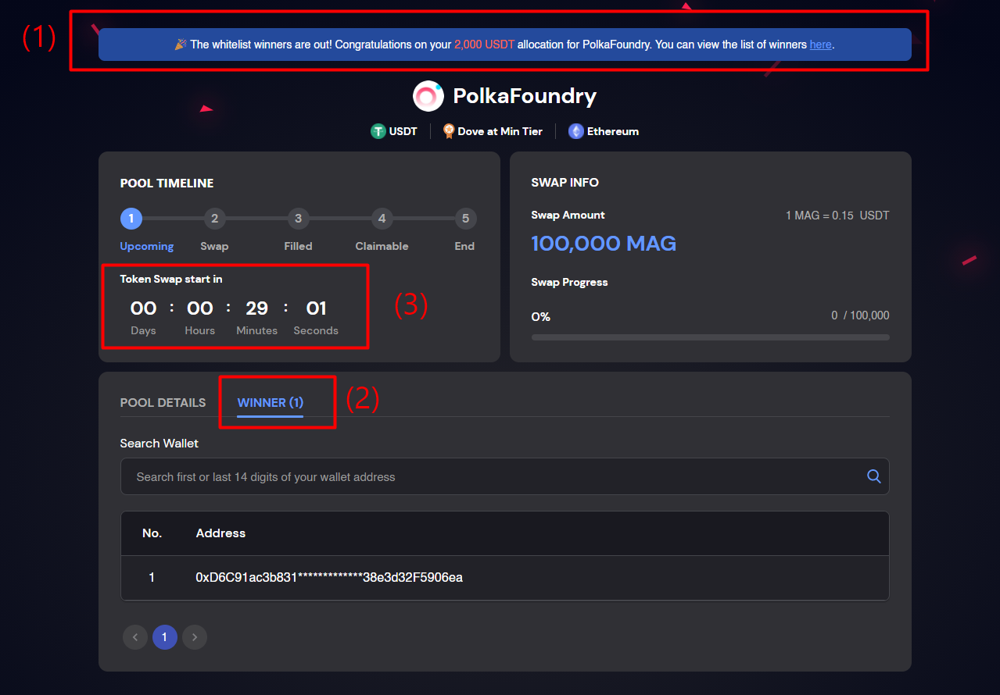
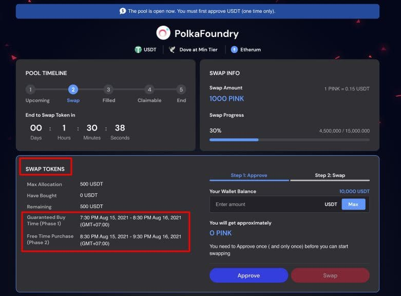
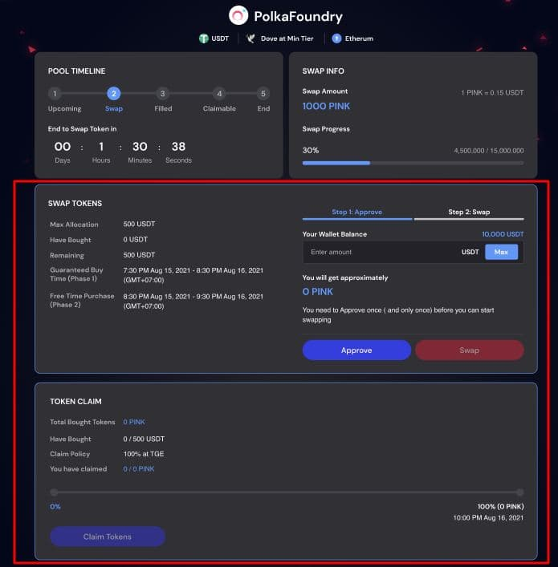
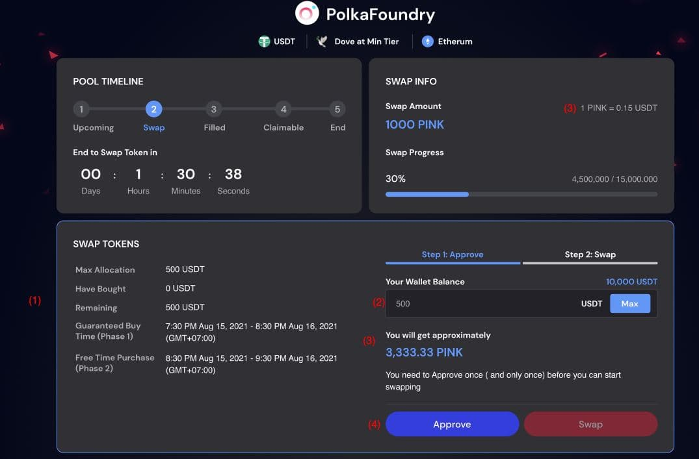
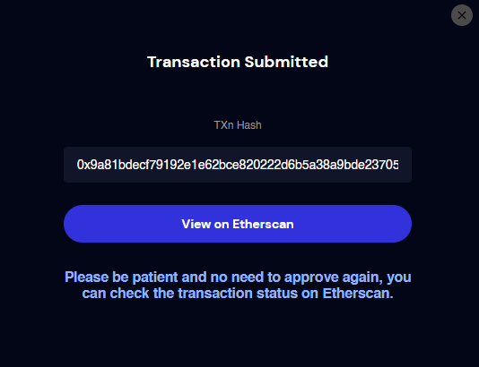
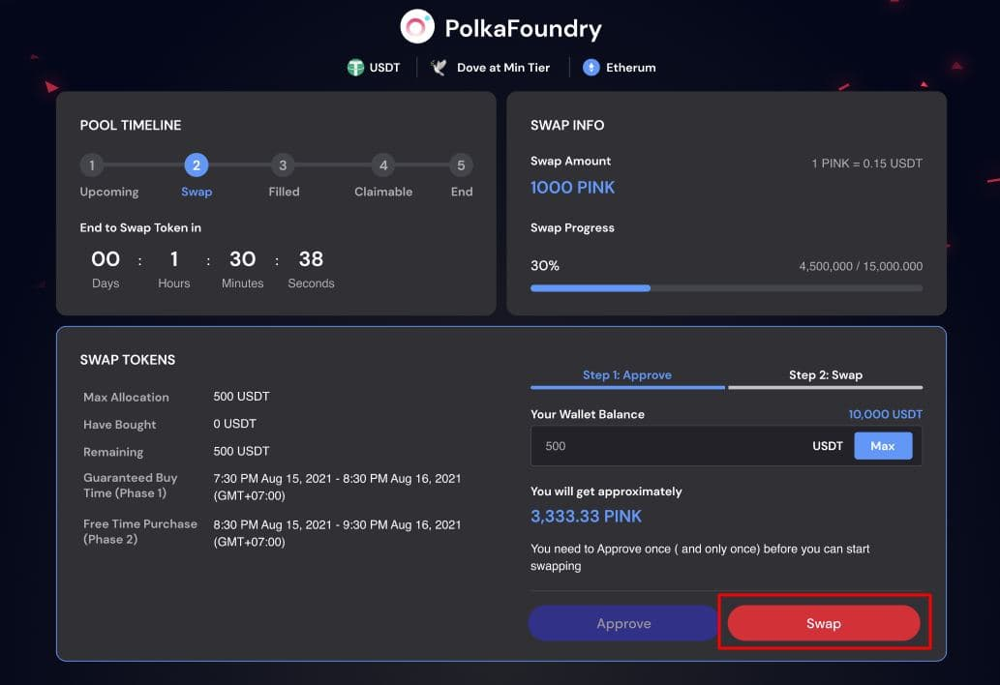
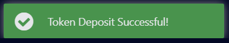
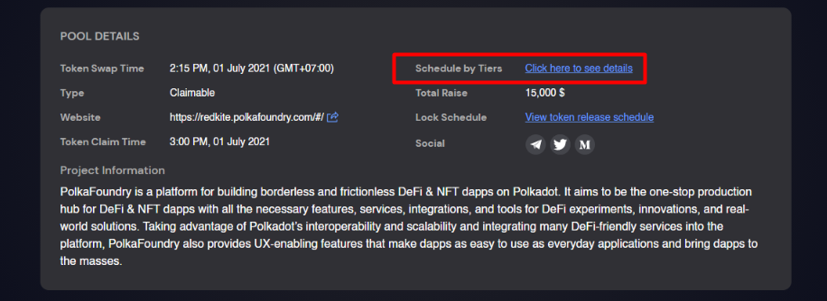
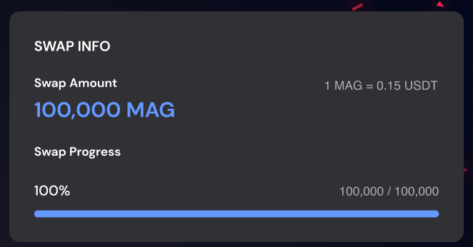
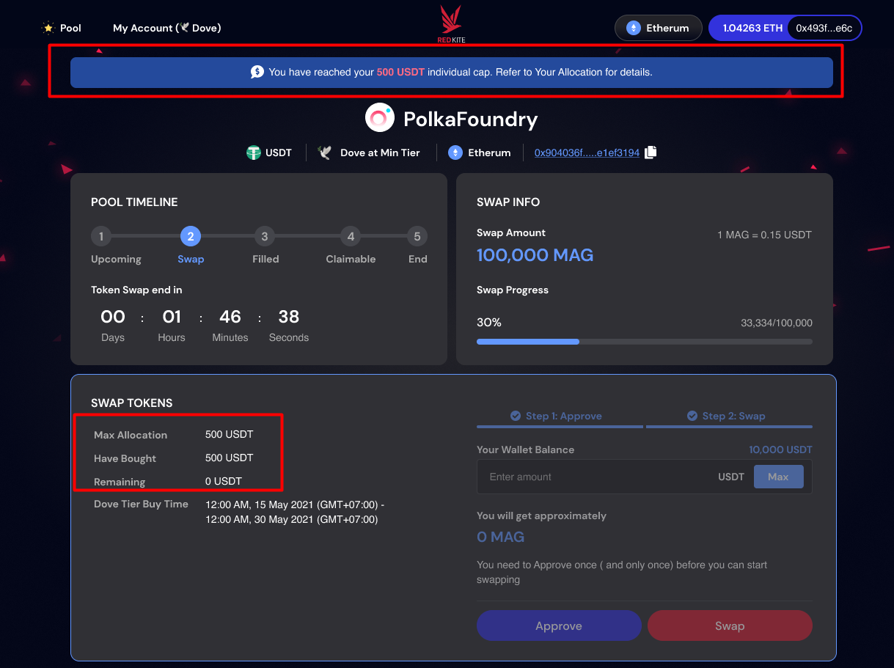

# II. How to Swap Tokens

---

## 2.1. Check your Allocation

You can check your allocation in the 2 following ways when whitelist winners of the pool are announced.

1. Go to My Account > My Pool, check the number on "Allocation" column. You can read more [here](https://redkite-faq.polkafoundry.com/guides/myaccount.html#_5-4-1-overview).

2. Select the pool for which you have applied whitelist successfully and open its detail.

:::danger NOTE
You must connect the wallet address which you have used to apply the pool’s whitelist.
:::

* On the pool detail:
  * You can see your allocation in the message on header. (1)
  * Click “Winner Tab” to see the list of whitelist winners. You can search your wallet address by using first or last 14 digits. (2)
  * Check the countdown on “Pool Timeline” area to see when you can start swapping tokens. (3)
* Be sure to check your wallet balance for the currency required by pool and ETH (BNB) for the gas fee as well before swapping.  
* After you have done this step, you just need to wait until the pool is open.

:::danger YOU MUST FOLLOW 2 STEPS BELOW TO SWAP TOKEN
* Step 1: Approve 
* Step 2. Swap Tokens
:::

## 2.2. Check your buy time

Red Kite includes 2 token purchasing phases, which are:

* **Phase 1:** For members with guaranteed allocation. If you are the winner of the pool and won an allocation, please purchase within Phase 1.
* **Phase 2:** At the end of Phase 1, if there are still any tokens left, this amount of tokens will be opened for sale in Phase 2 for everyone on the whitelist (whether winning or not winning the lottery and get guaranteed allocation or not). Each person will be able to buy up to a maximum of $ worth of tokens in the form of FCFS. The maximum amount is determined by each project.

Please check carefully the purchase time on the Token Swap area.

## 2.3. Step 1. Approve

* The “Swap Token” and “Claim Token” areas will appear when it comes to the Pool’s opening time.

* This step is required when the currencies required by the pool are non-native tokens. You must approve their use on the pool's smart contract. For pools using ETH or BNB (native tokens), this step is skipped.  
* You need to ***Approve once (and only once)*** before you can start purchasing.
* Navigate to “Swap Tokens” area:
  * Check your “Max Allocation, Buy Time” information. (1)
  * Input the amount you want to approve (or click Max to auto-fill with your max). (2) 
  * The token will be automatically calculated based on the amount you input and the exchange rate. (3)
  * Confirm all the information and click “Approve” button. (4)

  * Confirm the transaction in your wallet after clicking “Approve” button.
  * After confirming, you will see an option to view your transaction on Etherscan or BscScan.
    * Make sure to check the currency balance on your wallet.
    * Make sure you have ETH or BNB on your wallet for the Gas fee.
    * Only Gas fee is deducted from your wallet. Your currency balance remains the same.
    * Once you approved, you do not need to approve again You can check the transaction on Etherscan or BscScan.

 

 ## 2.4. Step 2 - Swap

* You can swap tokens after approving successfully. 
* On Step 2. Swap, enter the amount you want to purchase (or click Max to auto fill with your max) and click the “Swap” button.

* Confirm on your wallet and wait until the transaction is mined. The “Token Deposit Successful” message will be displayed after your transaction is confirmed and processed successfully. 
* You can check your purchased tokens on the Claim Token Area and just only need to wait for the pool time to finish before being able to claim and withdraw them.

**NOTE:** Please be aware that some of the circumstances below may prevent you from swapping tokens.

(1) The token sale schedule may vary depending on your tier. You will not be able to buy tokens until the starting purchase time of your tier is reached. Please click the hyperlink “Schedule by Tiers” on “Pool Details” section to check the schedule.

(2) It reaches the maximum Swap Amount. You can check the information on the Swap Progress bar in “Swap Info” section.

(3) Your wallet balance of pool currency and/or ETH/ BNB (for the gas fee) is insufficient.

(4) You have not completed the Step 1. Approve yet. Please check the 2.2. Step 1. Approve for more details.

(5) You have reached your maximum allocation.

