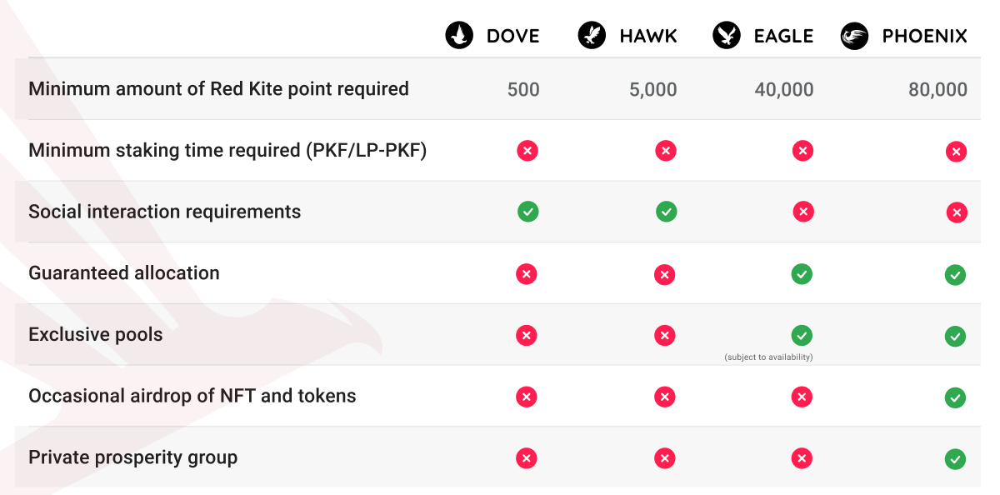

# IV. Tier and Reputation

---

## 4.1. Method

<h3> 4.1.1. Tier determination </h3>

The tier of each user on Red Kite is determined by the total number of Red Kite points they own. Users can earn Red Kite points through the following ways:
1. Staking PKF, PolkaFoundry native token, on Red Kite. Each staked PKF will earn 1 Red Kite point.
2. Adding PKF-ETH to Uniswap liquidity pool to get LP-PKF, then staking them to Red Kite. Each staked LP-PKF will earn 150 Red Kite points.
3. Contributing KSM, Kusama native token, to PolkaSmith’s crowdloan on Red Kite. Each locked KSM will earn 500 Red Kite points(*)

::: warning Note
(*) Read [**HERE**](https://medium.com/polkafoundry/polkasmith-kusama-parachain-auction-in-a-nutshell-e73892169719) to know more about the reward policies for KSM contributors.
:::

We no longer count the PKF staking on MANTRA DAO. If you have PKFs staked there, please unstake then re-stake them into Red Kite Launchpad.
::: tip Example
For example, John is staking 1,000 PKF and 20 LP-PKF, locking 2 KSM in the PolkaSmith’s crowdloan on Red Kite.

The number of Red Kite points John is owning = 1,000 + 20*150 + 2*500 = 5,000. According to the Tier conditions in Section 2, John is a Hawk.
:::

<h3> 4.1.2. Snapshot time </h3>

For a specific pool, the tier and token allocation of each user will be determined by the snapshot method at the time of closing the whitelist form of that pool.

From the snapshot moment until the pool’s sale ends, whitelisters need to maintain their tier equal to or higher than the tier defined at the snapshot time. Any case of tier reduction during this period will forfeit the right to join the pool.

After the snapshot, users can continue to earn more Red Kite points to increase their tier. The new tier is only valid for pools that have not taken a snapshot.

## 4.2. Tiers

<h3> 4.2.1. Dove </h3>

* Owning at least 500 Red Kite points and above;
* No fixed pool size;
* No minimum staking time required and unstaking delay (for PKF & LP-PKF);
* Lottery-based;
* Ticket price based on actual project & pool;
* Social interaction requirements: Join Telegram groups, subscribe to Telegram announcement channels, follow Twitter accounts, and retweet IDO/pool announcement with hashtags and cash tags.

<h3> 4.2.2. Hawk </h3>

* Owning at least 5,000 Red Kite points and above;
* No fixed pool size;
* No minimum staking time required and unstaking delay (for PKF & LP-PKF);
* Guaranteed allocation for whitelist. Allocation is prorated based on the amount of Red Kite points the user owning at the snapshot time;
* Social interaction requirements: Join Telegram groups, subscribe to Telegram announcement channels, follow Twitter accounts, and retweet IDO/pool announcement with hashtags and cash tags.

<h3> 4.2.3. Eagle </h3>

* Owning at least 20,000 Red Kite points and above;
* No fixed pool size;
* No minimum staking time required and unstaking delay (for PKF & LP-PKF);
* Guaranteed allocation for whitelist. Allocation is prorated based on the amount of Red Kite points the user owning at the snapshot time;
* No social interaction requirements;
* Exclusive pool for Eagle (subject to availability).

<h3> 4.2.4. Phoenix </h3>

* Owning at least 60,000 Red Kite points and above;
* No fixed pool size;
* No minimum staking time required and unstaking delay (for PKF & LP-PKF);
* Guaranteed allocation for whitelist. Allocation is prorated based on the amount of Red Kite points the user owning at the snapshot time;
* No social interaction requirements;
* Exclusive pool for the Phoenix tier such as seed and private sales;
* Occasional airdrop of NFT and tokens;
* Invitation to a private prosperity group with exclusive support only for Phoenix.

## 4.3. Others 

<h3> 4.3.1. KYC </h3>

* Since May 24, 2021, Red Kite has only accepted KYC via Blockpass.

<h3> 4.3.2. Luck Multiplier</h3>

* For tiers that apply lottery, suppose you do not win a ticket in a successful whitelisting. In that case, your luck will be doubled when you successfully participate in the next whitelist.