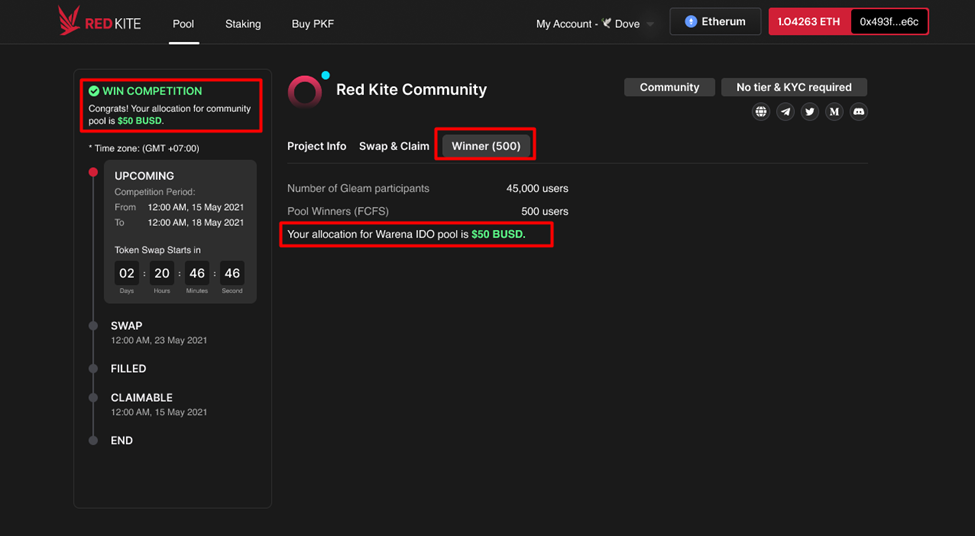

# How to join Community Pools

On Red Kite, there are no Tiers or KYC requirements for the Community Pool. To be eligible for the pool, all you must do is complete the social tasks on Gleam.

.png>)

## **I. Step 1. Select Pool**

Select a pool from the "Pool Community" section of the "Upcoming" area on the pool dashboard and view its details.

.png>)

## **II. Step 2. Complete Gleam Tasks**

### **1. Click the "Join Competition" button**

_**Note**_: The “Apply Whitelist” button is disabled if the whitelist application period is not yet open. You can check the application period in the Timeline area on the left side of the screen.

.png>)

### **2. Complete Gleam tasks**

You will be redirected to the Gleam Competition screen. You must complete all the social tasks on Gleam to be eligible for the community pool.

.png>)

A total of 500 winners will be chosen from all participants in the Gleam competition.

## **III. Step 3. Check allocation results.**&#x20;

You can find out if you won the community pool by using one of the ways listed below.

### **METHOD 1: Check allocation in the pool details**

1\. Go to the pool dashboard > Search for and open the pool that you joined the competition.

.png>)

2\. Go to the “**Winner**” tab or the “**Whitelist**” section on the left side of the screen to check your allocation.

* **If you are a community pool winner**: the “**WIN COMPETITON**” status & allocation will be displayed as below image if you are the winner of the community pool.

* If you are not a community pool winner: The allocation is not displayed for users who are not community pool winners.

.png>)

### **METHOD 2: Check allocation in the “My Pool” menu.**

1. Select “**My Account**” > “**My Pool**”

.png>)

&#x20; 2\. Check your status and allocation in the “**Status**”’ and “**Allocation**” columns.

.png>)

**Token swapping in the community pool is done on a first-come, first-served basis**. More information on how to swap tokens in the Community Pool can be found [here](../swap-and-claim-and-refund/how-to-swap-tokens.md).

### **** 
