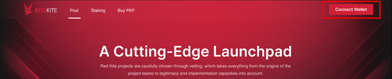

# How to connect wallet

To connect your wallet to Red Kite, follow the steps below.

* **Step 1**: Go to the [Red Kite Website](http://redkite.polkafoundry.com/#/dashboard)****
* **Step 2**: Click “Connect Wallet” in the header. The “Connect Wallet” popup will appear.

* **Step 3**: On the popup, select the network and the wallet you use. We recommend using Metamask, which is fully supported by Red Kite Website.

_**Note**_: Before connecting your wallet, you must agree Red Kite's Terms of Service and Privacy Policy.

* **Step 4**: You will be asked to confirm your wallet on the website. To connect your wallet, click "Sign" on the wallet. The information on the website will not be displayed accurately if you do not sign on your wallet to confirm.

