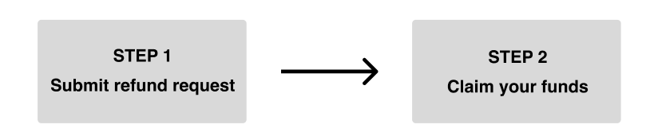
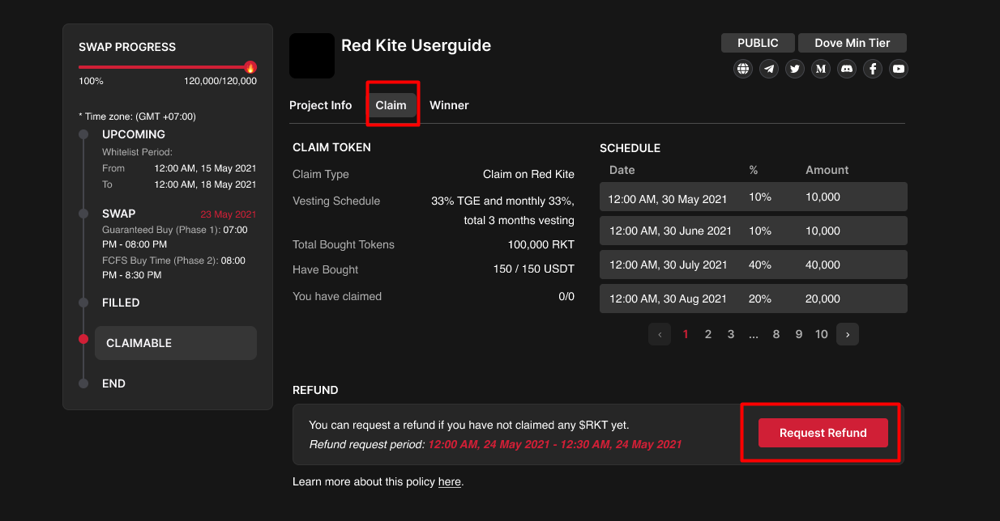
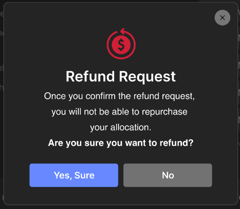

# Request Refund

****

2 steps to request a refund

<figure><figcaption></figcaption></figure>

## STEP 1: SUBMIT YOUR REFUND REQUEST

1. Visit the IDO page of the project on Red Kite Launchpad and select the “Claim” tab.

<figure><figcaption></figcaption></figure>

2\. Connect your wallet that had participated in the sale.

3\. Click on the “Request Refund” button. The “Refund Request” popup will appear, asking for your confirmation. To confirm your request, select the “Yes, Sure” option.

<figure><figcaption></figcaption></figure>

4\. You will be asked to sign on your wallet to confirm. After you sign, your refund request will be successfully submitted. Your refund status will be updated to “Refund Requested”.

<figure><figcaption></figcaption></figure>

## **STEP 2: CLAIM YOUR FUNDS**

1. Click the “Claim Refund” button to claim your funds. You will be asked to sign on your wallet to confirm.
2.  Your funds will be returned immediately to your wallet after your confirmation.

    <figure><figcaption></figcaption></figure>

NOTE\
\- You will not be eligible for a refund if you have claimed more than one token. The error message will be shown as below.

<figure><figcaption></figcaption></figure>

\- Your request must be submitted within the refund request time. If you do not request a refund, your status will be changed to “Not Request Refund”.

<figure><figcaption></figcaption></figure>
