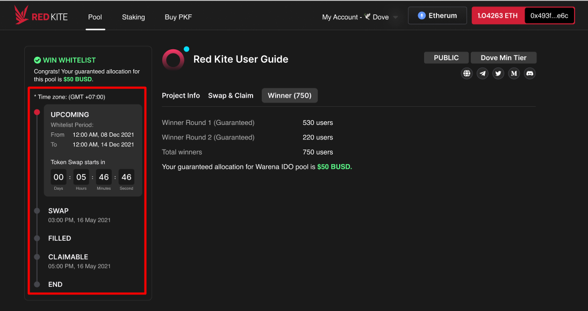
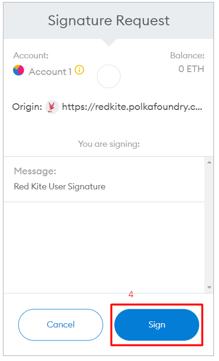
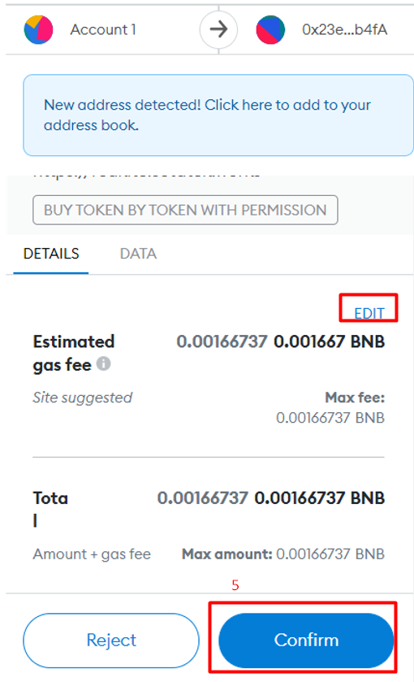
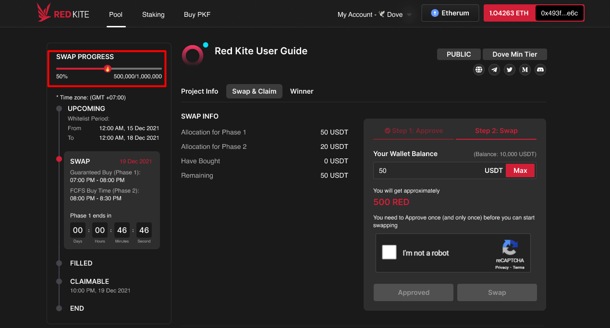

# How to swap tokens

## **I. Checklist before swapping token**

Before you swap tokens, make sure you go over the following checklists.

1. Have enough of the pool’s needed currency (BUSD, USDT…) in your wallet to purchase the tokens
2. Be prepared for the gas fee (Have BNB, ETH, MATIC…, which varies by pools in your wallet for gas fee)

You can check the “**Accepted Currency**” and “**Network**” in the pool detail.

>)

3\. Check all the milestones (Token Swap Time, Token Claim Time). This information can be found in the timeline on the left side of the screen.

**For IDO pools, there are 2 purchasing phases, which are:**

* **Phase 1 – Guaranteed Allocation**: For members with the guaranteed allocation (Winner of Round 1 and Round 2). If you are the winner of the pool and won an allocation, please purchase within Phase 1.
* **Phase 2 – First Come First Serve**: At the end of Phase 1, if there are still any tokens left, this number of tokens will be opened for sale in Phase 2 for everyone on the whitelist (whether winning or not winning the lottery and get guaranteed allocation or not). Each person will be able to buy up to a maximum of $ worth of tokens in the form of FCFS. The maximum amount is determined by each project.

**For Community Pools, there is just one purchase phase.** You can check the swap date time in the timeline on the left side of the screen.

## **II. Token Swap Steps**

When the token swap begins, go to the “**Swap & Claim**” tab to swap and claim your tokens. To swap the tokens, follow these two steps:

### **2.1.  STEP 1. APPROVE**

This step is required when the currencies required by the pool are non-native tokens. You must approve their use on the pool's smart contract. For pools using ETH or BNB (native tokens), this step is skipped.

You need to Approve once (and only once) before you can start purchasing. In the “Swap & Claim” tab:

1. Check your “Allocation”
2. Input the amount (or click Max to autofill with your max) to approve
3. Confirm all the information and click the “Approve” button

>)

You will be asked to confirm the transaction in your wallet. Click the “Approve” button to confirm. After confirming, you will see an option to view your transaction on Etherscan or Bscscan.

* Only Gas fee is deducted from your wallet. Your currency balance remains the same.
* Once you approved, you do not need to approve again. You can check the transaction on Etherscan or BscScan.

### **2.2. STEP 2 - SWAP**

After properly approving, you can swap tokens by following the below steps:

>)

1. Enter your allocation (Or click “**Max**” to auto-fill with your max allocation). The number of equivalent tokens you will receive is displayed after you fill in your allocation.
2. Verify by clicking the Captcha
3. Click the “**Swap**” button. This button is disabled if you have not yet verified the Captcha.
4. You will be asked to confirm on your wallet after clicking the “**Swap**” button. To confirm, click “**Sign**”.

5\. After confirming, the “**Buy token by token permissio**n” popup will appear. You can then adjust the gas fee before clicking the “**Confirm**” button to confirm the swap transaction and waiting for it to be mined.

The “**Token Deposit Successful**” message will be displayed after your transaction is confirmed and processed successfully.

>)

**You've completed all the steps required to swap tokens on Red Kite.** You can check your purchased tokens on the Claim Token Area and just only need to wait for the pool time to finish before being able to claim and withdraw them.

_**NOTE**_: Please be aware that some of the circumstances below may prevent you from swapping tokens.

1. **The pool's maximum swap amount is reached**. The swap process can be seen in the upper left corner of the screen. Due to the processing speed of the network, there is a very brief delay in displaying the sold tokens in the progress bar. In fact, tokens maybe 100% sold, which is determined by the block confirmation speed, before the progress bar in the pool detail is updated to 100%.

2\. You have not yet completed Step 1. Approve.

3\. Your wallet is not correctly connected, and you have not signed into it. More details on how to connect the wallet on Red Kite can be found here.
